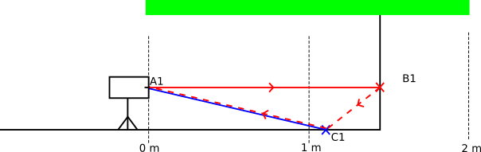
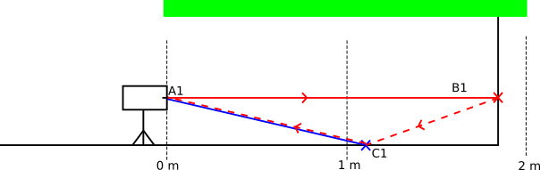
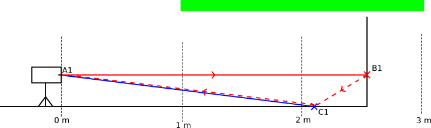
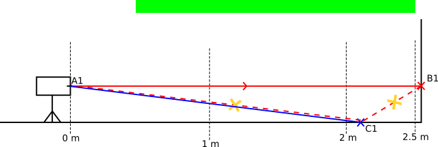

# Dealing with multi path interference

Multi path interferences (MPI) are well known for Time of Flight (ToF) systems.

## MPI explained
### "Normal" ToF artifact and its specificity with coded modulation

## Hints for dealing with MPI
### Intelligently using the offset and the range

