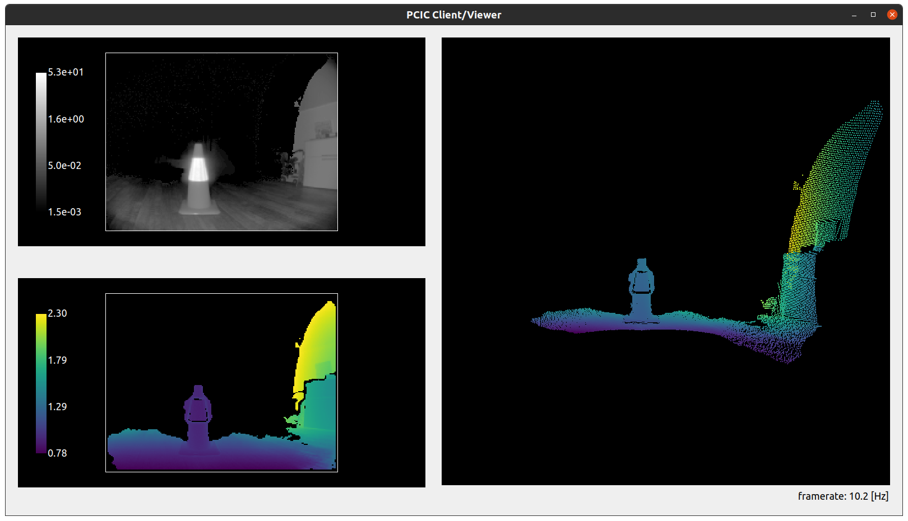
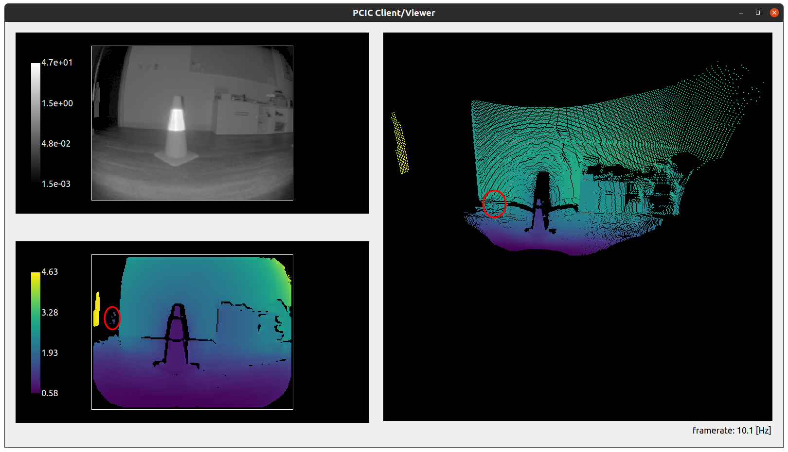
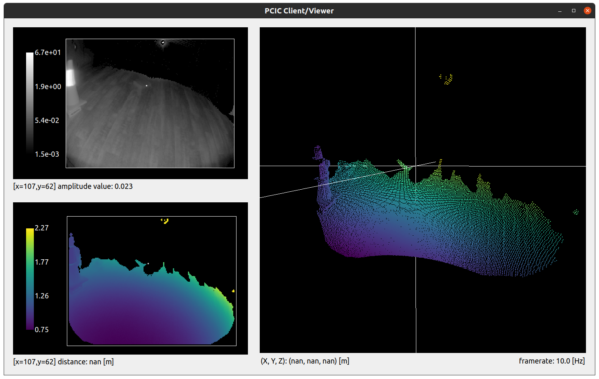
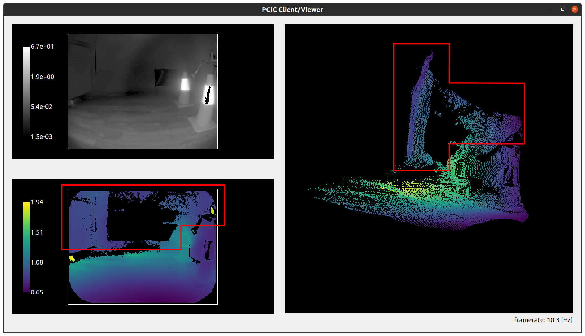
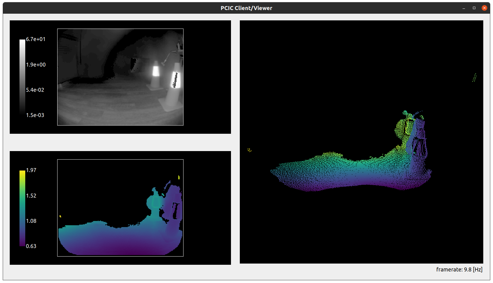

*Disclaimer: As a vendor of industrial equipment, we always try to mitigate physics artifacts to the best of our abilities. The default settings are chosen with this goal in mind: providing the best experience for **most** cases. However, the variety of scenes that mobile robots and other applications can encounter makes a "one-fits-all" configuration impossible. With this in mind, we present in our Application Notes the outliers, challenging but common cases that might require fine tuning of the camera configuration.*

# Dealing with highly reflective objects: the case of stray-light

Scenes including highly reflective objects are common in robotics and industrial use cases. These scenes can present challenges as reflectors introduce an artifacts known in optical systems as *stray-light*. In this document, we focus on this phenomenon and present the stray-light filter available with the O3R. We analyze some challenging cases and give hints on how to handle specific applications. 

*NOTE: the scenes presented here are recreated with the intention of highlighting specific challenges of mobile robot environment, here in our office. We detail our experience trying to "fool" the system but we are well aware of the limitations this approach. We always want to hear from first hand experience and we gladly welcome your feedback. @contact*

**Summary:**
Stray-light is a phenomenon that exists in any optical system where light reflected from very bright objects is bouncing around in the lens, impacting the measurement. Two main effects of stray light are noticed in 3D point clouds: the creation of a halo around the bright objects, and the apparition of "ghost" pixels in the close range. To mitigate these artifacts, a stray-light filter is available (turn it on with `diParam.enableStrayLight`). This filter can be fine tuned to be more or less conservative, depending on whether the application requires high accuracy or a rich point cloud (adjust `diParam.excessiveCorrectionThreshDist` and `diParam.excessiveCorrectionThreshAmp`).

**Table of content:**
1. The stray light phenomenon + filter intro
    1. Halo: before/after
    2. Ghosts: before/after
2. Fine tuning of the stray-light
3. Conclusion

## The stray light phenomenon

Stray-light designates any unwanted light reaching the optical lens of the camera. This light can be reflected light from an object within the field of view or emitted by an object outside the FoV. Stray-light exists in any non-perfect optical systems, where excessive amounts of light is reflected on internal parts of the system (within the lens or other camera components) and eventually reaches a pixel of the imager, interfering with the measurement. 
Common objects found in warehouses and other industrial environments like reflective cones or safety vests are sources of stray-light interference.

A typical effect of stray-light is to cause a halo of pixels around the reflective object affecting the measurement of weaker pixels in the area, but stray-light can also affect pixels not in the direct vicinity of the reflector, creating "ghosts" pixels typically in the close range, which can make the scene hard to analyze. 

Let's look at some concrete examples of stray-light artifacts. For the purpose of demonstration, we have disabled the built-in O3R stray-light filter.

### First case: the stray-light halo
A circulation cone with a reflective band is positioned 1m in front of the camera. We can observe a stray-light halo around the cone: pixels are measured where there should not be anything (the background is out of range in this case).

A cardboard box is positioned next to the cone, at the same distance from the camera. The halo is still there and impacting part of the background pixels. However, the measurement of the actual box is accurate and not impacted by the reflective object next to it. Stray-light affects more strongly the weaker pixels in the scene and in this case does not impact the measurement of the box which reflects enough light.

### Handling stray-light halos
The O3R camera comes with a built-in stray-light filter that mitigates stray-light artifact. This filter uses the optical system's invert model to estimate which pixels are overly affected by the stray-light and filter these according to set distance and amplitude thresholds (the default distance threshold is set to 8cm: if the stray-light impacts a pixel measurement more than 8cm, this pixel will be invalidated). 

Let's look at the first scene again, but this time with the filter activated. We can see that the halo has been greatly reduced around the reflective part of the cone. A similar result is achieved with the box in the scene.

The stray-light filter makes it possible to reduce mis-measured pixels in the vicinity of the reflector.
### Second case: "Ghost" pixels
Let's look at a second case of stray-light. A reflective cone is placed 1m in front of the camera. The background is a white wall, at around 2m. The stray-light filter is deactivated.

We can see (highlighted in the red circle) that some pixels are measured that do not exist in the real scene (there is no object there). This is a second effect of stray-light: non-existing pixels appear in the close range. 
This could create false positive measurements for instance when performing obstacle detection and trigger interruption of service.

### Handling "ghost" pixels

In the second scene, "ghost" pixels appeared in the close range due to stray-light. The filter also mitigate this artifact:

*NOTE TO MYSELF: Add a red circle to show where the ghost pixels disappeared.*

The side effect of this is the removal of additional pixels on the scene, as we can see in the floor area.
The O3R stray-light filter invalidates pixels that are flagged as over-affected by the stray-light: pixels whose distance or amplitude measurement is affected over the set threshold. We will see in the next section how to tune this distance threshold.

## Fine tuning the stray-light filter

The default settings of the filter are chosen to properly handle most cases of stray-light, but some scenes might require fine tuning it.
We focus here on obstacle detection cases that prove challenging with the default settings of the filter.

*INTERNAL NOTE: The two cases presented here are somewhat conflicting (one calls for lowering the threshold, the other for increasing it). Should we keep both? How should we handle this?.*
### Obstacle detection
In cases where obstacle detection is the main application, one can accept that stray light affects the scene such that some pixels will be measured as much as 10cm off their real position, as long as the obstacle is detected and false negatives are avoided. Let's focus on scenes where the sources of stray-light are limited (a single reflector or smaller reflective surfaces).

The interesting setting in this case is the `excessiveCorrectionThreshDist`. This setting defines the distance threshold above which a pixel affected by stray light will be discarded.

Let's look at a scene with and without stray light. A box (the obstacle) is placed on the floor, and we measure the distance to it.
- Scene without reflector:

We choose a reference pixel on the side of the box. The distance measured for this pixel is 1.527m.

- Scene with reflector:

For the exact same scene, we add a reflector to the side of the field of view. 

We can see the a whole side of the box disappears. This is due to the stray-light that affects the scene: the pixels are marked as invalid by the stray-light filter because of their distance measurement being impacted.

- Adjusting the distance threshold

Let's adjust the distance threshold setting, `excessiveCorrectionThreshDist`. It's default value is `0.08m`, which means that any pixel affected more than `8cm` will be discarded. Let's set it to `0.2m`.

We can see that we are able to recover most of the pixels from the side of the box. However, the distance measured for the same pixel is now 1.590m, when our reference measurement is 1.527m. The side of the box is measured 6.3cm off it's actual position. This is acceptable in this case, as the robot will be able to drive along the reflector and still detect the presence of an obstacle.

*INTERNAL NOTE: The reference pixel measurement (with "no stray-light") was probably already corrected by the stray-light filter in the first image. This explains why we only measure it 6cm off and not 8 as the distance threshold would suggest. This scene has to be re-setup to have the initial measurement with stray-light filter deactivated.*

**Warning:**
Relaxing the distance threshold value impacts which stray-light pixels are discarded by the filter. By doing so, you risk allowing some ghost pixels in the scene which might in turn create false positive obstacles.

### Multiple reflectors in the scene

Scenes involving multiple reflectors can have pretty dramatic stray-light artifacts. In these cases, getting rid of all the stray-light ghost pixels might require to strengthen the filter. Let's analyze a specific example and see how it can be handled.

The scene is set up with two reflectors along the expected path of the robot. We imagine that the robot is moving forward, and therefore must detect the floor and potential obstacles.

Let's have a look at the scene with the stray-light filter deactivated. Pretty dramatic, right? The two reflectors create so much stray-light that the whole path of the robot is blocked by ghost pixels (see highlighted in red).

Now let's reactivate the filter and see what we get.

The ghost pixels almost completely disappeared, and the path forward is mostly clear. But we can still see remaining ghost pixels in the close range above the robot (denoted with the red circle). A measurement indicates that these pixels are 0.8m away from the camera, which could be in the path of the robot if it or it's payload reaches this height. The robot would therefore be blocked from moving forward by an obstacle detection algorithm, even though the path is clear.

We can once more adjust the stray-light filter to ensure we filter away all the remaining ghost pixels. To do so, we can use the distance threshold as presented earlier. This time, we are trying to remove extra-pixel, so we are going to lower the distance threshold (we set it to 0.5). We can see that all the ghost pixels are now gone and the robot can proceed to it's route obstacle free.

*INTERNAL NOTE: This scene could also be handled with the amplitude threshold. A good approach could be to present the distance threshold in the first example and the amplitude threshold in the second. I am hesitant, I find the distance threshold easier to understand in relation to the real scene... Thoughts?*

## Conclusion

As we saw with the examples detailed above, there is no "one-fits-all" configuration for handling stray-light in robotics applications. Proper configuration needs to be selected after reviewing the scenes the robot is expected to encounter. The number and position of highly reflective surfaces that will enter the field of view at a certain time impacts the necessary strength of the filter. Multiple configurations can be stored on board the O3R and we encourage bringing some intelligence to the use of the platform to adapt the cameras' configurations to the scene where necessary. 

---------------------------------------------------------------
Everything past this line is ongoing work, open discussion, etc

## Other interesting cases to study:

### Impact of motion

