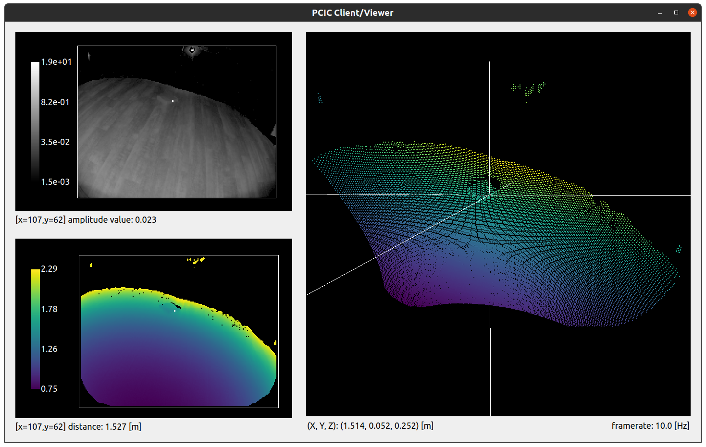
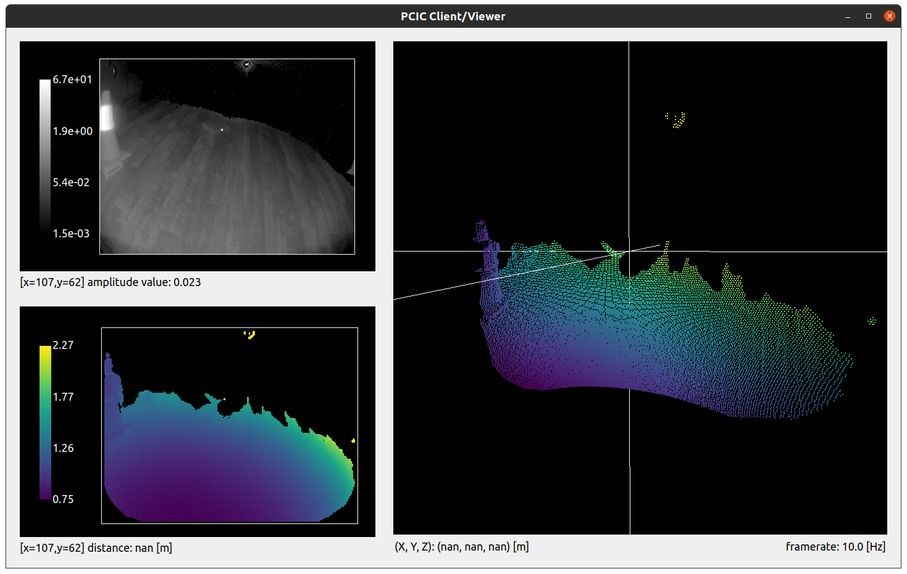
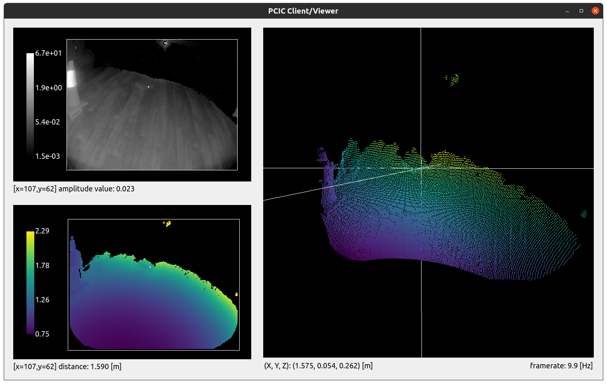

# Dealing with highly reflective objects: the case of stray-light

Scenes including highly reflective objects are common in robotics and industrial use cases. These scenes can present challenges as reflectors introduce an artifacts known in optical systems as *stray-light*. In this document, we focus on this phenomenon and present the stray-light filter available with the O3R. We analyze some challenging cases and give hints on how to handle specific applications. 

*NOTE: the scenes captured here are "with what I had on hand at the moment" type of measurement are are meant to illustrate my point. Scenes should be replicated in a more "professional" setup if/where necessary.*
## The stray light phenomenon

Stray-light designates any unwanted light reaching the optical lens of the camera. This light can be reflected light from an object within the field of view or emitted by an object outside the FoV. Stray-light exists in any non-perfect optical systems, where excessive amounts of light is reflected on internal parts of the system (within the lens or other camera components) and eventually reaches a pixel of the imager, interfering with the measurement. 
Common objects found in warehouses and other industrial environments like reflective cones or jackets are sources of stray-light interference.

A typical effect of stray-light is to cause a halo of pixels around the reflective object affecting the measurement of weaker pixels in the area, but stray-light can also affect pixels not in the direct vicinity of the reflector, creating "ghosts" pixels typically in the close range, which can make the scene hard to analyze. 

Let's look at some concrete examples of stray-light artifacts. For the purpose of demonstration, we have disabled the built-in O3R stray-light filter.

### Scene 1: Stray-light halo
A circulation cone with a reflective band is positioned 1m in front of the camera. We can observe a stray-light halo around the cone: pixels are measured where there shound not be anything (the background is out of range in this case).

A cardboard box is positioned next to the cone, at the same distance from the camera. The halo is still there and impacting part of the background pixels. However, it is important to note that the measurement of the actual box is accurate and not impacted by the reflective object next to it. Stray-light, which affects more strongly the weaker pixels, does not impact the measurement of the box which reflects enough light.

### Scene 2: "Ghost" pixels
Let's look at a second case of stray-light. A reflective cone is placed 1m in front of the camera. The background is a white wall, at around 2m. The stray-light filter is deactivated.

We can see (highlighted in the red circle) that some pixels are measured that do not exist in the real scene (there is no object there). This is a second effect of stray-light: non-existing pixels appear in the close range. 
This could create false positive measurements for instance when performing obstacle detection and trigger interruption of service.
## The O3R stray light filter

The O3R camera comes with a built-in stray-light filter that mitigates stray-light artifact. This filter uses the optical system's invert model to estimate which filters are overly affected by the stray-light and filter these according to set distance and amplitude thresholds (the default distance threshold is set to 8cm: if the stray-light impacts a pixel measurement more than 8cm, this pixel will be invalidated).
### Handling stray-light halo

Let's look at Scene 1 again, but this time with the filter activated. We can see that the halo has been greatly reduced around the reflective part of the cone. A similar result is achieved with the box in the scene.

The stray-light filter makes it possible to reduce mis-measured pixels in the vicinity of the reflector.

### Handling "ghost" pixels

In Scene 2, "ghost" pixels appeared in the close range due to stray-light. The filter also mitigate this artifact:

*NOTE TO MYSELF: Add a red circle to show where the ghost pixels disappeared.*

The side effect of this is the removal of additional pixels on the scene, as we can see in the floor area.
The O3R stray-light filter invalidates pixels that are flagged as over-affected by the stray-light: pixels whose distance or amplitude measurement is affected over the set threshold. We will see in the next section how to tune this distance threshold.

## Fine tuning of the stray-light filter

Some specific cases might need to fine tune the stray-light filter, to make it more or less conservative depending on the application.
We see two main application categories that might require a different tuning of the stray light filter: obstacle detection, where accuracy is less of a concern, and logistics automation tasks, where accuracy is a priority.

### Obstacle detection
In cases where obstacle detection is the main application, the user might prefer a rich point cloud to very high accuracy. One can accept that stray light affects the scene such that some pixels will be measured as much as 10cm off their real position, as long as the obstacle is detected and false negatives are avoided.

The interesting setting in this case is the `excessiveCorrectionThreshDist`. This setting defines the distance threshold above which a pixel affected by stray light will be discarded.

Let's look at a scene with and without stray light. A box is placed on the floor, and we measure the distance to it.
- Scene without reflector:

We choose a reference pixel on the side of the box. The distance measured for this pixel is 1.527m.

- Scene with reflector:

For the exact same scene, we add a reflector to the side of the field of view. 

We can see the a whole side of the box disappears. This is due to the stray-light that affects the scene: the pixels are marked as invalid by the stray-light filter because of their distance measurement being impacted.

- Adjusting the distance threshold

Let's adjust the distance threshold setting, `excessiveCorrectionThreshDist`. It's default value is `0.08m`, which means that any pixel affected more than `8cm` will be discarded. Let's set it to `0.2m`.

We can see that we are able to recover most of the pixels from the side of the box. However, the distance measured for the same pixel is now 1.590m, when our reference measurement is 1.527m. The side of the box is measured 6.3cm off it's actual position. This is acceptable in this case, as the robot will be able to drive along the reflector and still detect the presence of an obstacle.

*QUESTION: Why was that pixel initially discarded when it is actually affected less than the 0.08 default distance threshold?*

*NOTE TO MYSELF: Remember to add a warning that messing with the distance setting might mean that some ghost pixels are not eliminated.*

### Logistics automation

*NOTE: This section should probably be filled with examples with the 60° head.*

### Other interesting cases
- Multiple reflectors scene (Mo's use case).  
- Reflectors in the very close range.
- Dirty lens/ dusty environment
    