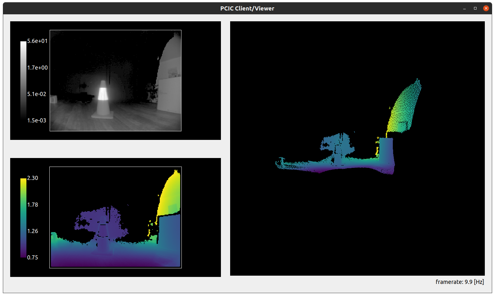
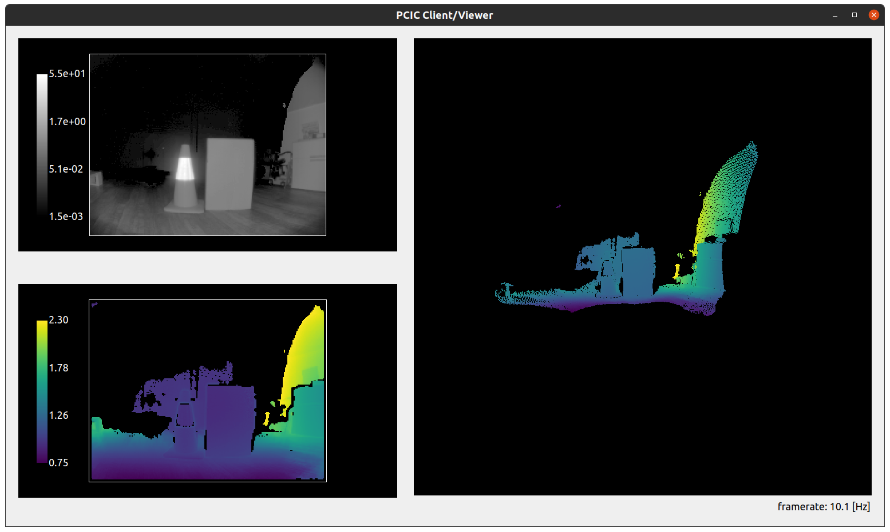
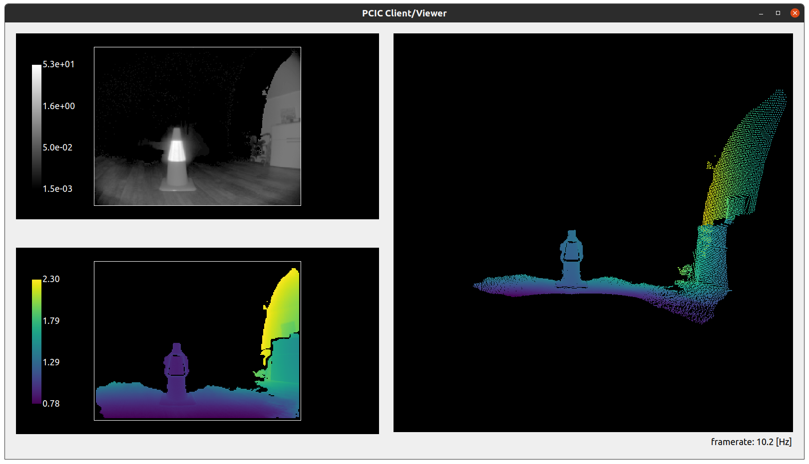
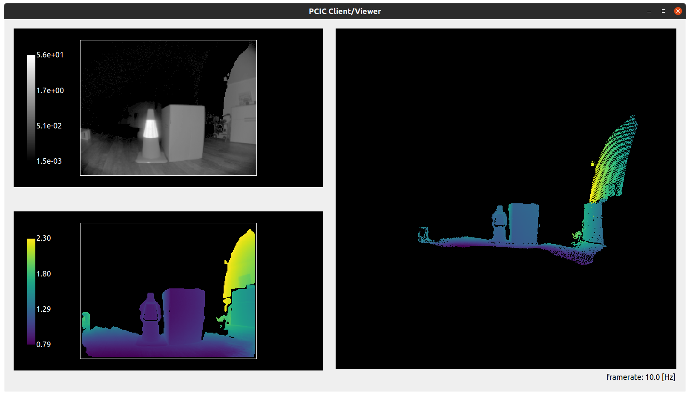
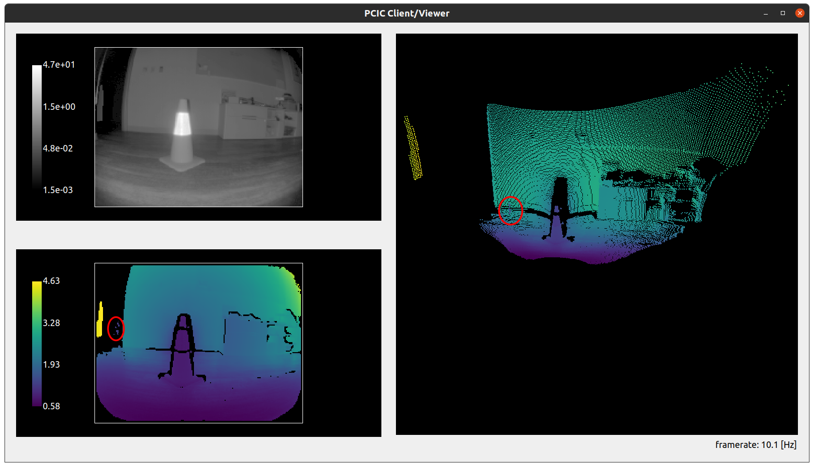
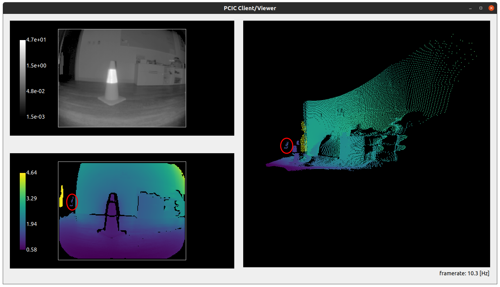
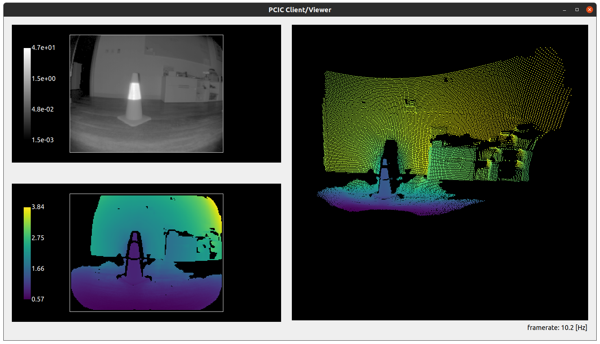

# Dealing with highly reflective objects

Scenes including highly reflective objects are common in robotics and industrial use cases. These scenes can present challenges as reflectors introduce an artifacts known in optical systems as *stray-light*. In this document, we focus on this phenomenon and present the stray-light filter available with the O3R. We analyze some challenging cases and give hints on how to handle particularly tricky cases. 

## The stray light phenomenon explained

Stray-light designates any unwanted light reaching the optical lens of the camera. This light can be reflected light from an object within the field of view or emitted by an object outside the FoV. Stray-light exists in any non-perfect optical systems, where excessive amounts of light is reflected on internal parts of the system (within the lens or other camera components) and eventually reaches a pixel of the imager, interfering with the measurement. 
Common objects found in warehouses and other industrial environments like reflective cones or jackets are sources of stray-light interference.

A typical effect of stray-light is to cause a halo of pixels around the reflective object affecting the measurement of weaker pixels in the area, but stray-light can also affect pixels not in the direct vicinity of the reflector, which can make the scene hard to analyze. 
It is important to note that the stray-light artifact will affect more strongly pixels returning a weaker light signal: pixels that are further away or reflect less light than the reflector itself (dark materials).

Let's look at some concrete examples of stray-light artifacts. For the purpose of demonstration, we have disabled the built-in O3R stray-light filter.

### Scene 1
A circulation cone with a reflective band is positioned 1m in front of the camera. We can observe a stray-light halo around the cone: pixels are measured where there shound not be anything (the background is out of range in this case).

### Scene 2 
A cardboard box is positioned next to the cone, at the same distance from the camera. The halo is still there and impacting part of the background pixels. However, it is important to note that the measurement of the actual box is accurate and not impacted by the reflective object next to it. The light reflected by the box is strong enough that the stray-light has no impact on the measurement. 

## The O3R stray light filter

### Handling stray-light halo

The O3R camera comes with a built-in stray-light filter that mitigates this stray-light artifact. 
This filter uses the optical system's invert model to estimate which filters are overly affected by the stray-light and filter these according to set distance and amplitude thresholds (the default distance threshold is set to 8cm: if the stray-light impacts a pixel measurement more than 8cm, this pixel will be invalidated).

Let's look at [Scene 1](#scene-1) again, but this time with the filter activated. We can see that the halo has been greatly reduced around the reflective part of the cone. A similar result is achieved with the box in the scene.

The stray-light filter makes it possible to reduce mis-measured pixels in the vicinity of the reflector.

### Handling "ghost" pixels

Let's look at a second case of stray-light. A reflective cone is placed 1m in front of the camera. The background is a white wall, at around 2m. The stray-light filter is deactivated.

We can see (highlighted in the red circle) that some pixels are measured that do not exist in the real scene (there is no object there). This is a second effect of stray-light: non-existing pixels appear in the close range. 
This could create false positive measurements when performing obstacle detection and trigger interruption of service.
The filter also mitigate this artifact:

The side effect of this is the removal of additional pixels on the scene, as we can see in the floor area.
The O3R stray-light filter invalidates pixels that are flagged as over-affected by the stray-light: pixels whose distance or amplitude measurement is affected over a threshold.

## Fine tuning of the stray-light filter

When the dynamic range in the scene is high, multiple reflectors are introduced or we require high accuracy, we might need to fine tune the stray-light filter.

- Multiple reflectors scene (Mo's use case).  
- Halo "ring" on darker background (Crown's case).  
- Reflectors in the very close range.
- Dirty lens/ dusty environment
    