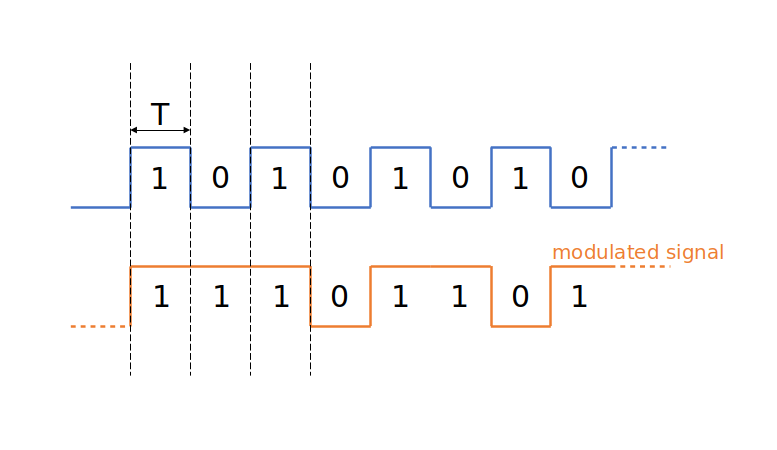
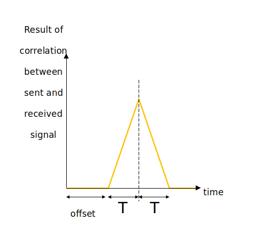
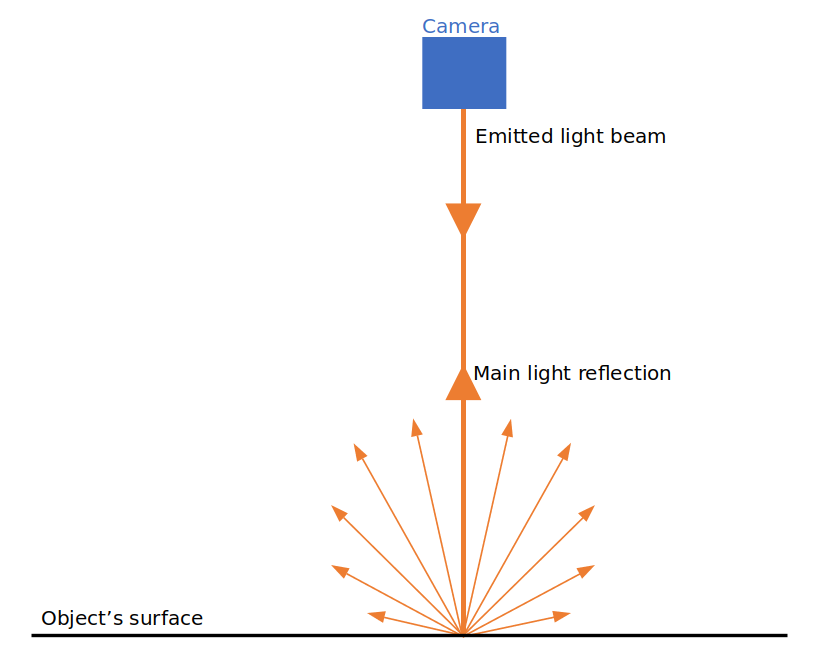
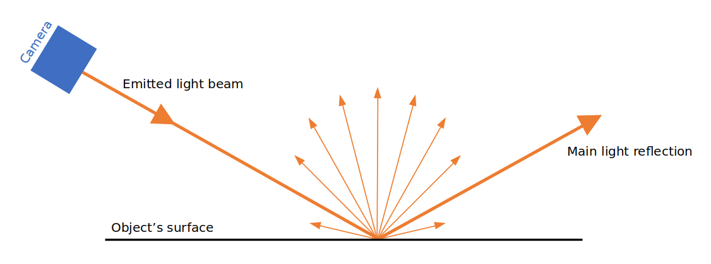

# Basic concepts of ToF and coded modulation

This documents presents the basic concepts of indirect time-of-flight (ToF) and coded modulation that make up the core technology of the O3R 3D camera head. We also introduce useful miscellaneous concepts that help understanding what is observed within the point cloud.

## Indirect ToF
 
In indirect Time-of-Flight (ToF) systems like ifm's O3R camera, an amplitude modulated light wave is sent by an illumination device ([VCSEL](https://en.wikipedia.org/wiki/Vertical-cavity_surface-emitting_laser) in our case). This signal is reflected off the surface of the objects present in the environment and travels back to the camera. The measuring device (a [PMD](https://pmdtec.com/en/technology/time-of-flight/) (Photonic Mixing Device) imager) measures the *phase* difference between the emitted and the reflected signal (unlike for *direct* ToF, where the *time* is measured until the signal returns to the device). This phase measurement is proportional to the length of the light path. The imager is a grid of photosensitive pixels, each of which functioning as it's own measurement unit outputting the distance to different part of the environment. 

*Note:* the phase difference measurement is inferred from correlating the received signal with four shifted versions of the modulation signal (shifted 90° from each other). This technique also helps mitigating artifacts in cases where the measured object is in motion (see details [LINK SYMMETRY]). 

One main issue with indirect ToF is the problem of ambiguity range. Because the emitted signal repeats over time, the distance measured is ambiguous: it is not possible to know how many complete periods repeated before reflection against an object, hence an object two periods "away" will appear as close as an object one period "away", and so on. 

Coded modulation can be used to mitigate this artifacts. 

## Coded modulation
**FLAG: Should we keep this section?**

The idea of coded modulation is to apply a binary code to the emitted continuous wave, making it irregular over a certain amount of time, following a predefined pattern. For example: 

 
In this drawing the initial wave (in blue) is the same as the one used for regular Time-of-Flight cameras. It repeats every 2T. The second signal (in orange) is the modulated signal. How soon it repeats depends on the length of the code. For the O3R, two modes are available by default, with ambiguity ranges of 48 m and (?). At such a distance, the reflected light is usually not sufficient to perform any measurement, so the problem of ambiguity range is eliminated for targets with a "normal" reflectivity. It can still happen that highly reflective objects influence the measurement even at a long distance. 

The reflected signal and the emitted signal are correlated. If the reflected signal is within the range +/- T (T being the smallest period of the initial wave signal), the correlation operation will result in a high measurement. If the object is further away, the convolution operation returns zero (see picture below). The only objects measured are within a range of -T and +T period shift. Read more about coded modulation range [LINK TO MODEs]. 

 
 An offset can be applied to shift the beginning of the measurement range further in space [LINK TO OFFSET DOC]. 

## Miscellaneous concepts 

### Reflection of light and angle of incidence

When considering a specific scene for a ToF measurement, it is helpful to understand how the light is reflected and how it impacts the measurement of specific objects. 

The light reaching an object is partially reflected with the same angle as the angle of incidence (this is the [specular reflection](https://en.wikipedia.org/wiki/Specular_reflection)). If the light beam is perpendicular to the surface, most of the light will be reflected back directly to the emitter. However, if the angle of incidence is low, most of the light is reflected away from the light source  (see images below).

The rest of the light is reflected in all the other directions (see [diffuse reflection](https://en.wikipedia.org/wiki/Diffuse_reflection)). This allows the receptor to receive *some* light even when the angle of incidence is very low. However, the lowest the incidence angle, the less light is reflected to the receptor. This means that different geometrical configurations for measuring the same object can give different results, especially for dark objects reflecting very little light.

> Note: how much of the light is reflected in which direction is defined by the [bidirectional reflectance distribution function](https://en.wikipedia.org/wiki/Bidirectional_reflectance_distribution_function).
