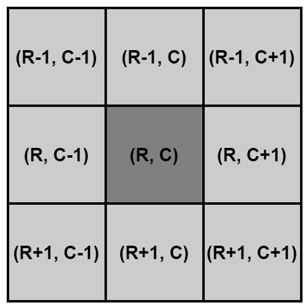
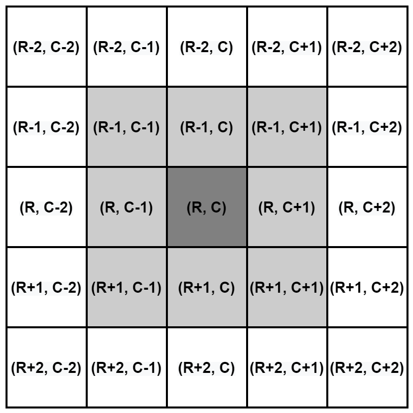
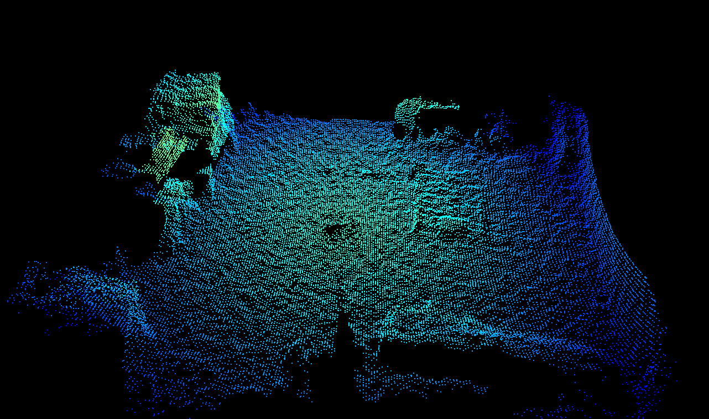
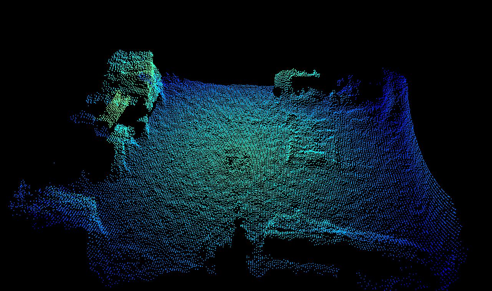

# Adaptive noise bilateral filter

## Table of contents
- [Adaptive noise bilateral filter](#adaptive-noise-bilateral-filter)
  * [Table of contents](#table-of-contents)
  * [Abstract](#abstract)
  * [Description](#description)
    + [`anfFilterSizeDiv2` values example pictures](#-anffiltersizediv2--values-example-pictures)
    + [spatial fitering under movement and rotation](#spatial-fitering-under-movement-and-rotation)
  * [related filters](#related-filters)
  * [related application notes](#related-application-notes)

## Abstract
The O3R software allows for filtering the distance image and the dependent point cloud image in the spatial domain. The spatial domain of a 3D image can be thought of as the local neighbourhood in the images pixel coordinates, i. e. row and column coordinates, or the related 3D coordinates, i. e. X-, Y-, and Z-coordinates of the distance image projected into R3 space. Radial distance information of pixels within a local neighbourhood are combined following the mathematical description of the filter to form a new image with less noise.  

The bilateral filter is the preferred spatial filter. It can be applied with different filter mask sizes which can be set via the parameter `anfFilterSizeDiv2`. For larger filter mask sizes the local noise reduction and flattening is more pronounced. 

## Description

This documentation mainly focuses on the lateral / spatial filtering when using the bilateral filter. This is the prefered spatial filter compared with the spatial median filter as it allows for less 'smearing' of edge information meaning it will presereve edge information better. It is also possible to apply the bilateral filter with larger filter masks (up to 7x7 pixel mask) compared to (5x5 pixel masks) for the median filter. The bilateral filter has better chararcteristic to preserve corner in images.  

This distance bilateral filter is in it's concept very similar to a [bilateral filter applied to RGB 2D images](https://en.wikipedia.org/wiki/Bilateral_filter). Any bilateral filter is a non-linear edge-preserving smoothing filter. It can be thought of as a filter which replaces the value per pixel with a weighted average of the information from nearby pixels. The weighting is a combination of the spatial kernel and the range kernel. The O3R implementation additionally incorporates the distance noise estimation for calculating the filter weights.     

Such a wighted average is computed by convlution over the spatial domain. The convolution of the original image and the filter mask returns an image reduced by half the filter size at each image border, i. e. widt and height minus the size of the filter pixel mask. The image is not adjusted to be continued at the image borders. These image border pixels are filled with invalid pixels.   

The bilateral filter is controlled by the parameter `anfFilterSizeDiv2`.    
`anfFilterSizeDiv2 = 0` is equivalent to turning the filter off. The image is not filter with the bilateral filter anymore.   
  
  
`anfFilterSizeDiv2 = 3` is equivalent to setting the filter mask size to a local 7x7 pixel neighbourhood.   

Invalid pixels will be ignored during the filtering process and have therefore no impact on the sourounding pixels. Invalid pixels will stay invalid after the filtering, i. e. no hole filling.  

TODO: decide which parameters will be made public: `anfSigmaLat` and `anfFactorRangeNoise`. These parameters allow for further finetuning of the bilateral filter.  

A list of related filters and application notes can be found below: [related filters](related-filters), [related application notes](related-application-notes)

### `anfFilterSizeDiv2` values example pictures
The following pictures give an overview of the capabilities of spatial filtering with the bilateral filter for different filter mask sizes: The temporal filter was not active to show independent effect of the bilateral filter. Spatial median filter is not active. The maximum allowed distance noise is set of 0.2 m for all images. For lower maximum distance noise validation the point cloud becomes very sparse for lower spatial filter settings.  

The scene shown has no dynamics to allow the presentation of the spatial filter effect in a single image. Please keep in mind that a typical application with no temporal filtering and high ammounts of spatial filtering is a representative scenario for scenes with ego-motion.
  
  
  
  
 
### spatial fitering under movement and rotation
Filtering in the spatial domain when movement is present is independent of movement. Only parts of the images which are not affected by movement will be filtered in the spatial domain. This differentiation is possible, becuase the detection of motion is performed before the spatial filer in the processing pipeline. Therefore it is perfectly fine to even use larger filter mask sizes.
This application is quite common, compared to temporal filtering under motion (perfered for static scenes: TODO add [see temporal filter]).

## related filters
+ spatial median filter
+ temporal filtering
+ validation filters
    + min amplitude checks
    + min reflectivity checks

## related application notes