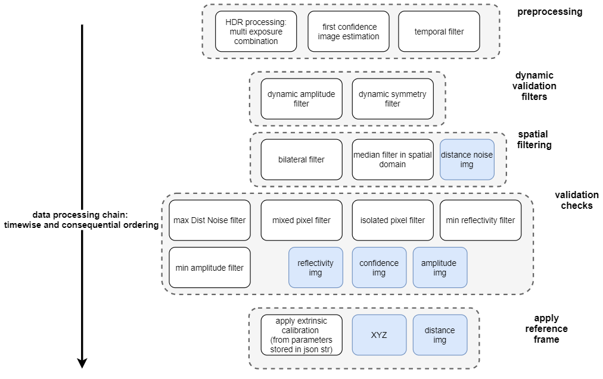
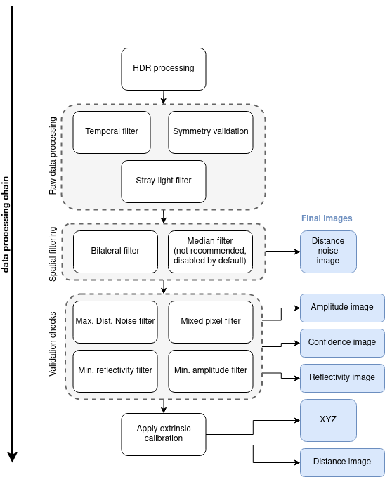

# Filtering process

This document details the filtering process applied to the O3R ToF data to produce distance measurements. Each filter listed below can be enabled/disabled or fine-tuned to better fit your application. Please read the detailed documentation for each individual filters (linked below) for more details.

<!--  -->

# Related topics
- Find an overview of the filters [here](parameters.md)
- Find a description of the available images [here](INSERT-LINK)