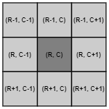

# isolated pixel filter

|Name|Minumim|Maximum|Default
|--|--|--|--|
| isolatedPxFilterMaxValid3x3 | 1 | 9 | 5 |

## Table of contents
- [isolated pixel filter](#isolated-pixel-filter)
  * [Table of contents](#table-of-contents)
  * [Abstract](#abstract)
  * [Description](#description)
  * [filer effect](#filer-effect)
    + [`mixedPixelFilterMode` values example pictures](#-mixedpixelfiltermode--values-example-pictures)
  * [related filters](#related-filters)
  * [related application notes](#related-application-notes)

## Abstract

The O3R software allows pixel based validation checks for filtering locally isolated pixels. This concept of locally isolated pixel is very sililar to the mixed pixel filter. The difference in the areal criterions is their neighbourhood. For the `isolatedPxFilterMaxValid3x3` filter mode only a 3x3 PIXEL neighborhood is examined (compared to a true spatial relation in R3 for the `mixedPixelFilterMode`).  

**If you are looking for a filter comparable to what is commonly known as a flying pixel eraser, please see the documenation of the mixed pixel filter TODO add link to mixed pixel filter.**  

## Description
The following image shows an examplery representation of a pixel neighbourhood. Only a 3x3 neighbourhood is shown, so the closest pixels around the relevant image pixel in row (R) and column (C) image coordiantes. 

If not enough pixels in this neighbourhood are valid, depending on the threshold set for the `isolatedPxFilterMaxValid3x3`, before the isolated pixel filter is applied the pixel itself will be marked as invalid. Counting at image borders is adapeted to the actual available image neighbourhood? This validation filter is applied late in the filter pipeline after all other validation filters. It therefore works on the results of the previous filters as a last validity check.

The filter definition is identical to what is known as image erosion (image morphology) for binary images: see this Wikipedia link [Erosion (morphology)](https://en.wikipedia.org/wiki/Erosion_(morphology)).

## filer effect 
### `mixedPixelFilterMode` values example pictures
TODO add pictures for the same static scene with different counters on the 3x3 mask   

TODO brainstorm applications  

## related filters
+ mixed pixel filter
+ further validation filters
    + min amplitude checks
    + min reflectivity checks
    + dynamic symmetry checks
    + cw plausiblity

## related application notes