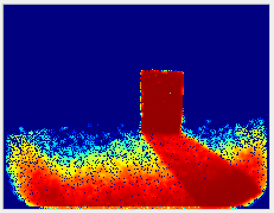
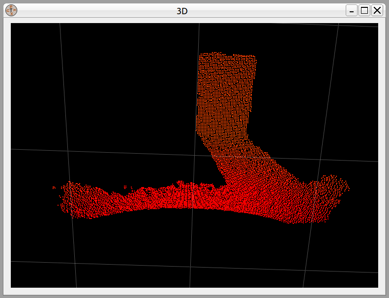
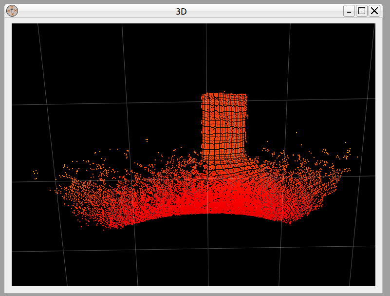

# Maximum distance noise
## Abstract

The O3R software estimates distance noise per pixel in addition to the distance information per pixel. This distance noise parameter is an estimation of the standard deviation of the radial distance measurement, given in meters. It is based on a noise model built upon the acquired time of flight (ToF) measurements of a single frame. Depending on the threshold value `maxDistNoise`, pixels are marked as invalid.

## Description
The O3R camera and software uses the ifm ToF technology for measuring the distance of objects per pixel. The result is a distance image as well as a distance noise image. The distance noise deduction can be interpreted as a standard deviation of the distance measurement in a metric scale. The noise level is dependent on the received signal's amplitude (lower amplitude means greater noise) and on the ambient light level (high ambient light level, especially sunlight, can lead to high noise level). 

The distance noise image gets processed in the same algorithmic pipeline as the distance image itself. Any filter applied to the distance image are applied to the distance noise image as well. For example if filters are activated in the spatial domain (see the [bilateral filter](INSERT-LINK)), they also filter the distance noise image, such that the adapted noise image reflects the lowered noise due to lateral filtering.

The parameter `maxDistNoise` is used to invalidate pixels with high noise levels. Higher `maxDistNoise` values will allow more noisy pixels to be  valid pixels in the point cloud. The maximum allowed value is 1 meter, though we do not recommend using such a high value as the resulting distance measurement will be highly inaccurate in the noisy areas. 
Low `maxDistNoise` values will result in more noisy pixels being marked as invalid. Using values lower than 0.01 meters is not recommended either as it invalidates large portions of the image for many scenes (we expect a distance standard deviation of about 0.5 percent of the measurement range).    

The minimum allowed `maxDistNoise` value is 0.00 meters. This will switch off the validation process based on the estimated distance noise image. The distance noise image is still computed and available to the user.

### Example
The following table shows the measurement for a same scene with two different distance noise threshold values. The scene consists of a box positioned one meter away from the camera, outside in full sunlight. The amount of noise due to the ambient light is high, but we see that we can still get distance values for many pixels by increasing the noise threshold.

| Noise value (m)| Distance noise image| | Point cloud|
|:--:|--|--|--|
| 0.01| | | |
| 0.07 | | | |

> Note: the distance noise image is the same for both noise threshold value. The difference is viewed in the point cloud, where more or less pixels are discarded by the noise filtering.
### expected distance noise over distance
The distance noise is dependent on the actual measured distance. A specific distance noise expectation over absolute distance can be seen in the data sheet in section / figure: TODO add link to data sheet / insert distance noise over distance figure.  EXAMPLE [Lucid Helios 2 distance noise](https://thinklucid.com/product/helios2-time-of-flight-imx556/#tab-performance)

All this means is for a certain distance noise threshold value pixels at larger distances are more likely to be invalidated.   

[low maxDistNoise value] -> 0.015  
[high maxDistNoise value] -> 0.2

## Should you use very low `maxDistNoise` values?
The user may think that a simple change of the `maxDistNoise` value will 'improve' the point cloud, because it will result in more valid pixels. The tradeoff between many pixels, i. e. a rich point cloud, and a more robust point cloud, i. e. only more reliable pixels, is part of the finetuning for each application.  

We suggest to start with the default values. The default is currently set to `0.02` meters. This value was chosen leaning more towards a robust point cloud with few artefacts. This might not be true for all customer applications. Please also keep in mind that `maxDistNoise` threshold works in connection and relation with other filters as mentioned above.

## Related topics
+ [Bilateral filter](INSERT-LINK) (see also the [median filter](INSERT-LINK))
+ [Temporal filter](INSERT-LINK)
+ [Minimum amplitude](INSERT-LINK)
+ [Minimum reflectivity](INSERT-LINK)
