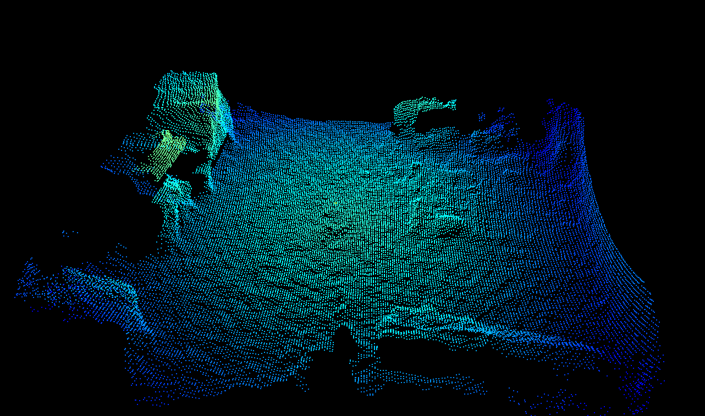

# (spatial) median filter

* [Abstract](#abstract)
* [Description](#description)
* [Example](#example)
* [Bilateral VS median filtering](#bilateral-vs-median-filtering)
* [Related topics](#related-topics)
## Abstract
The O3R software supports two spatial filters for improving the distance measurements, the median filter and the [bilateral filter](bilateralFilter.md).   
**We recommend using the bilateral filter in most cases instead of the median filter, as the median filter can have undesirable side effects.**

## Description

The median filter is in it's concept very similar to a [median filter applied to RGB 2D images](https://en.wikipedia.org/wiki/Median_filter). A median filter is a non-linear edge-preserving smoothing filter. It can be thought of as a filter which replaces the value per pixel with the median value of neighboring pixels. The computation is achieved by sliding the filter mask in the spatial domain until having covered the whole image. 
This filtering technique is robust (i.e., not impacted by outliers), and reduces noise while keeping edge information intact. 
The median filter is applied to the distance image as well as to the distance noise image. 

The median filter is controlled by the parameter `medianSizeDiv2` (turn it off with 
`medianSizeDiv2 = 0`). 
`medianSizeDiv2 = 1` sets the filter mask size to a size of 3x3 pixel.
`medianSizeDiv2 = 2` is the highest allowed value. It represents a filter mask size of 5x5 pixels.
Using larger filter mask sizes results in combining more pixels' distance measurements into the filterer value. The effect of the filter will be stronger, resulting in a *smoother* image.

>Note: Invalid pixels are ignored during the filtering process and have therefore no impact on their surrounding pixels. Invalid pixels remain invalid after the filtering. 
 

## Example
Below are shown images of the same scene with different settings for the median filter. Look more specifically at the distance noise image that shows the amount of noise in the scene: the larger the filter mask size, the lower the noise level (the color red corresponds to negligible noise levels, blue to noise around 1cm and above). See the [bilateral filter](bilateralFilter.md) example for comparison with the same scene.

| Filter mask size `medianSizeDiv2`| Point cloud| Distance (top left), amplitude (top right), distance noise (bottom left) and reflectivity (bottom right) images| |
|--|--|--|--|
| 0 (filter deactivated)| | | |
| 1 (3x3 mask size)| | | |
| 2 (5x5 mask size)| | | |

## Bilateral VS median filtering
### Disadvantages of the median filter
The median filter is not our spatial filter of choice for two reasons: it does not preserve corners of objects as well as the bilateral filter, and it uses a heuristic method for dealing with the distance noise image. Also, the median filter can introduce a bias in the distance image (locally) in some cases, an effect which is not present in the bilateral filter.
We recommend using the [bilateral filter](bilateralFilter.md) in most cases.

### Bilateral and median filters combined
It is rare that a combination of both spatial filters is required and we recommend increasing the filter mask size as a first step. However, if the filtering is not strong enough, one can use both the bilateral and median filters at the same time. This will further reduce local noise levels, but can result in bias in larger noise patterns. 

To give you an idea, we show below the effect of combined bilateral and median filtering for the scene of our example:
   
 
## Related topics
+ [Bilateral filter](bilateralFilter.md)
+ [Temporal filter](INSERT-LINK)
+ [Minimum amplitude](minAmplitude.md)
+ [Min reflectivity](INSERT-LINK)

