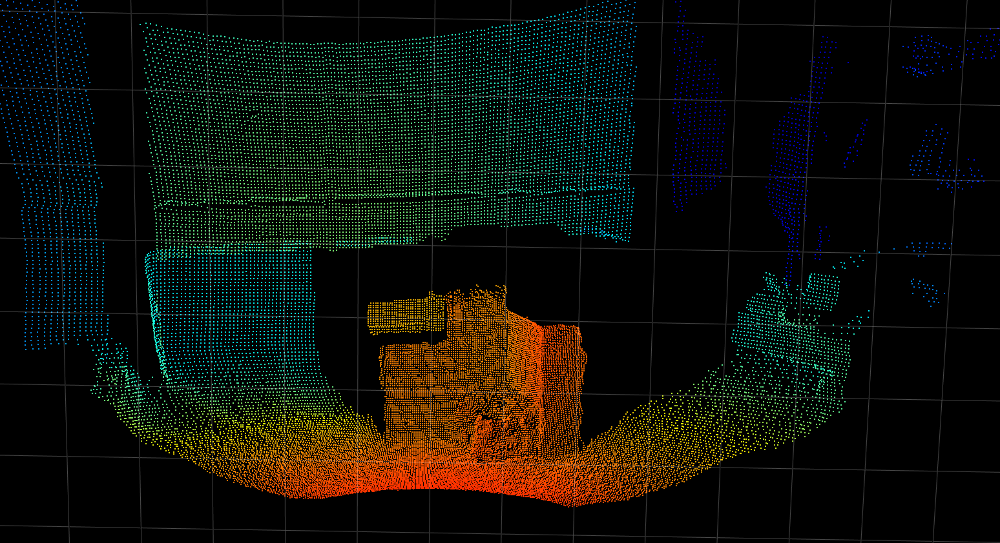
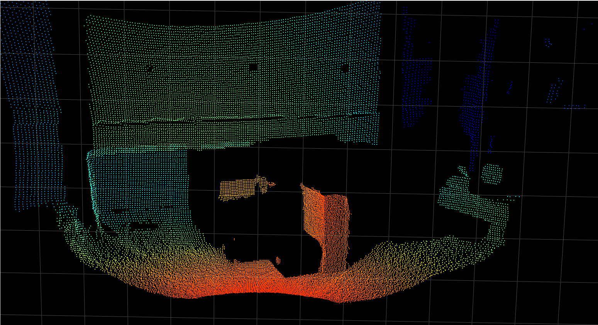

# Parameter: Minimum Amplitude

| Name | Minimum | Maximum | Default |
| -----|---------:|:---------|:---------:|
| Minimum amplitude | 0 | 1000 | 20 |

## Abstract

The `Minimum amplitude` parameter invalidates pixels where the amplitude (reflected light) drops bellow the minimum threshold.

## Description

A 3D image taken with the O3R-Camera-Head contains several information. Distance information is one, but also amplitude. For each pixel, the amplitude value represents about how much light was received by the imager. This kind of image is called `amplitude image`.

Amplitude image:

Point cloud:

If the amplitude value drops to 0, no light was received and therefore no distance measurement was taken. The `Minimum amplitude` parameter,provides a threshold/limit when the system should discard the pixels. Is the amplitude value dropping bellow this threshold, the pixel is shown as `invalid - low amplitude`.

|minimum amplitude| Images|
|:-:|-|
|0||
|20||
|50||

In certain cases, changing the default value form 20 to 0 could be beneficial. Generally speaking, as lower the amplitude as more `noisy` and inaccurate is the distance measurement.

Bad reflecting objects (e.g. black ones) are reflecting less light, and therefore tend to fall easier under the minimum amplitude than bright objects. For the O3R, objects which are not reflecting infrared light are appearing as black objects. In this use cases, it might be beneficial to decrease the minimum amplitude to get some data back. Even, if this data is more noisy than the same data from bright objects.

## Dependencies / Related topics

The `minimum amplitude` parameter is corelating with the `maximum distance noise` parameter. A low amplitude value together with a heigh distance noise value, validates more pixel. Together with the `temporal filter` the image gets more stable too. See following:
[Link `distance noise`]
[Link `temporal filter`]