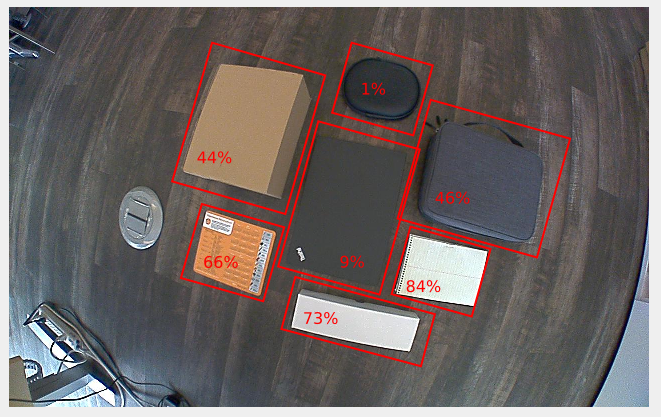
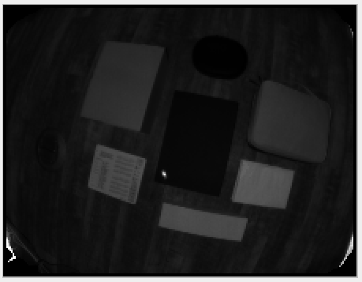
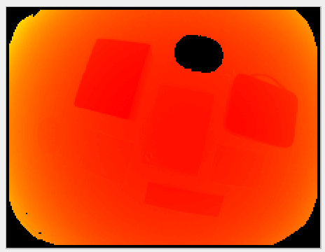
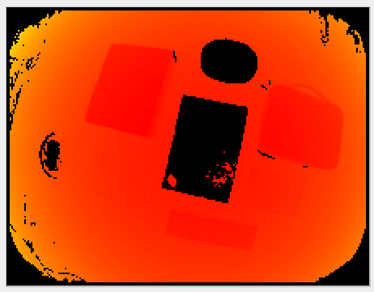

# Minimum reflectivity

## Description

Reflectivity (in a near infrared (NIR) spectrum) is a characteristic of the material of the object reflecting the light. It depends on its surface material, but also on the geometric configuration of the scene.
The minimum reflectivity (`minReflectivity`) filter invalidates pixels with low amounts of received light, meaning pixels on objects with a reflectivity below the minimum threshold.
The reflectivity is computed from the distance and the amplitude images.
It can be used to discard unwanted pixels in scenes where an object's reflectivity is known in advance. 
It can also be used to identify highly reflective objects in a scene: a threshold of 100 would invalidate everything but the retro-reflectors.
## Example
In the image below, we show various objects with their measured reflectivity. We can see that in this case the reflectivity depends on the material of the object only, as their surfaces are seen under the same angle relative to the surface normal. The estimated reflectivity might vary for a same object seen under varying angles to surfaces normals. Note that we are talking here about reflectivity in the NIR spectrum. Some objects might show a higher or lower reflectivity than what we would expect in the visible spectrum.

The corresponding reflectivity image is nothing more than a gray-scale image, darker shades representing lower reflectivity values:

In the table below, we show the computed distance image for default settings of the O3R heads with different values for the reflectivity threshold `minReflectivity`:

| Reflectivity| Distance image|
| --| --|
| 0| |
| 5| |
| 10| |

> Note: In the first image, some pixels are missing from the side of the object. This area of the object does not reflect enough light, even when a low reflectivity threshold is allowed.

## Related topics
- [Minimum amplitude](minAmplitude.md)
- [Available images](images.md)