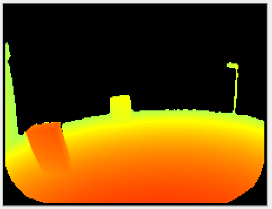
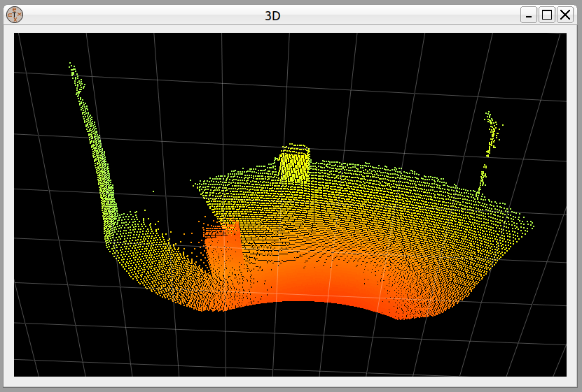
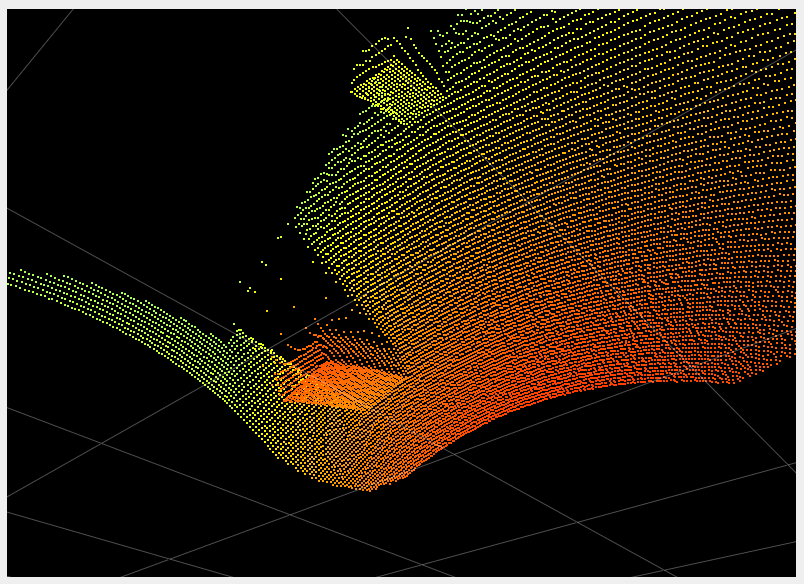
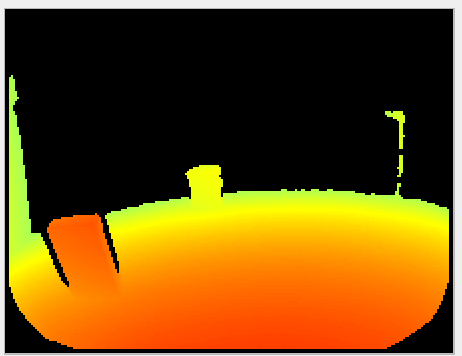
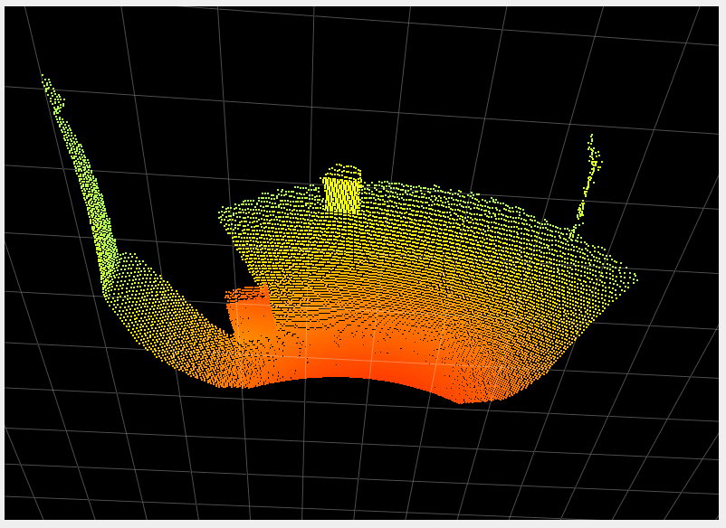
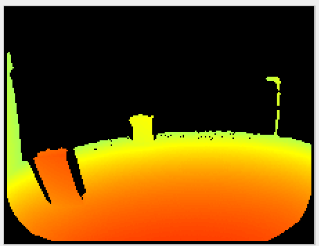
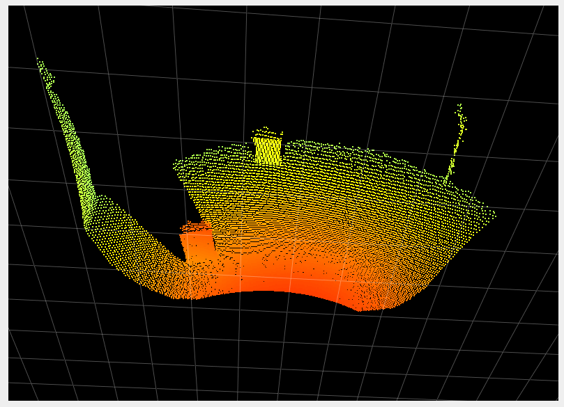
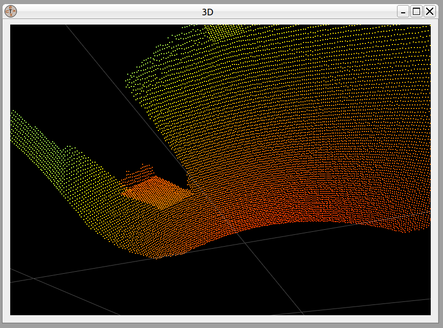

# Mixed pixel filter
## Abstract

The mixed pixel filter removes spatially isolated pixels. We call these pixels mixed pixels as they result from a mixed signal from foreground and background planes (typically, the pixel "lands" partially on an object and partially on its background). Such pixels don't represent the distance measurement to either object and lie somewhere in between (they appear to be *flying*, and we sometimes refer to them as *flying pixels*). The `mixedPixelFilterMode` setting defines whether this filter is activated and which validation methods is used. `mixedPixelFilterMode = 1` switches to angle validation check. `mixedPixelFilterMode = 2` switches to distance based validation check. `mixedPixelFilterMode = 0` switches the filter off completely.

**We suggest either disabling the filter (more precision on objects' edges) or using the angle based validation method (`mixedPixelFilterMode = 1`) to remove pixels between objects and their backgrounds.**

## Description
The `mixedPixelFilterMode` controls two different methods for invalidation mixed pixels.  

### Angle based validation method  
The angle based mixed pixel filtering (`mixedPixelFilterMode = 1`) is based on the idea of estimating, for each pixel, the angle between the optical and an approximate tangent plane on the object (at this exact pixel coordinate). If the angle difference is larger than the allowed angle threshold, the pixel is invalidated.  
The angle threshold of this mode is controlled by the parameter `mixedPixelThresholdRad` (angle in radians).

### Distance based validation method
The second version of the mixed pixel (`mixedPixelFilterMode = 2`) filter is centered around the idea of comparing distances in the local neighborhood of a pixel. The distance of the pixel is compared in horizontal and vertical direction against its neighboring pixels' distance values. If the distance differences are outside a threshold (set internally), the pixel is invalidated.

## Examples
### Different mixed pixel modes

To show the impact of the mixed pixel filter and its different modes, we show a scene where two boxes are place in front of the camera, at around one and two meters. The table below shows the distance image and the point cloud with the filter inactive and with the two filtering modes:

| Mixed pixel filter mode| Distance image| Point cloud|
|--|--|--|
| 0| ||
| | | |
| 1| | |
| | | |
| 2| | |
| | | |
 
We can see that the second mode (distance based filtering) is much stronger than the first mode (angle based) and invalidates more pixels around objects. It should only be used in very specific cases where extra strength of the filter is required. Typically, we recommend either disabling the filter to get more precise edges to objects, or using the angle based filtering to invalidate pixels between objects and their background.

