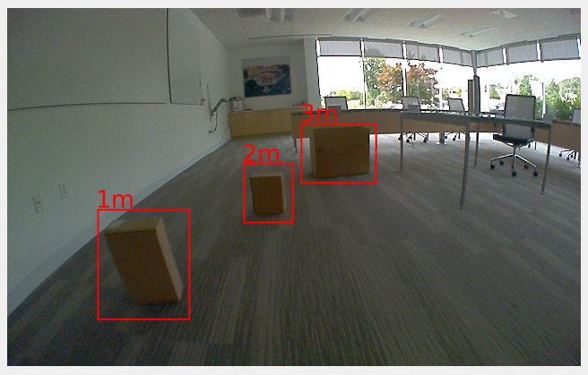
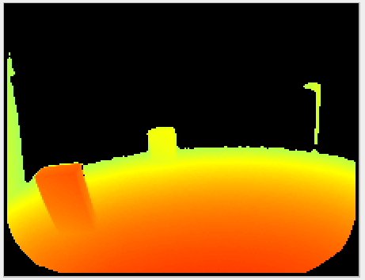
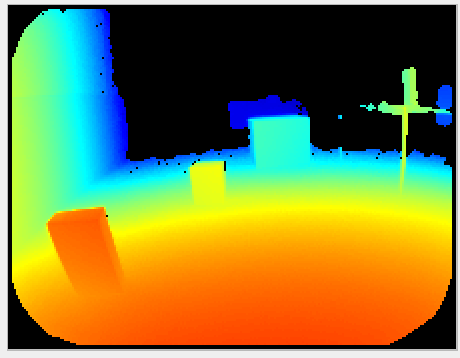

# Modes

## Description

The O3R uses the concept of coded modulation applied to ToF technology (see [basic concepts](INSERT-LINK)). A specificity of this technique is to provide specific measurement ranges: a distance measurement is computed only for a specific subspace of the scene, elements outside of the range are not taken into account.

By default, the O3R provides two measurement ranges: two meters and four meters. These ranges use different frequencies to perform the ToF measurement, and therefore show different characteristics especially in how they are impacted with artifacts.

## Example

Let's look at a simple scene: three boxes are placed in front of the camera, one, two and three meters away (see image below).

The table below shows the computed distance measurement in the distance image view and the point cloud view with the two modes available by default:

| Mode| Distance image| Point cloud|
|--|--|--|
| 2m| | |
| 4m| | |

The third box, which is 3 meters away from the camera, is outside of the measurement range when using the two meter mode, however it is visible when using the four meter mode.

> Note: Using the [offset](INSERT-LINK) in combination with the mode is interesting and allows for a lot of flexibility in using the coded modulation ToF technology. We encourage you to investigate strategies using multiple modes in combination with offsets (see our [application note](INSERT-LINK) on the topic)

## Related topics
+ [Offset](INSERT-LINK)
