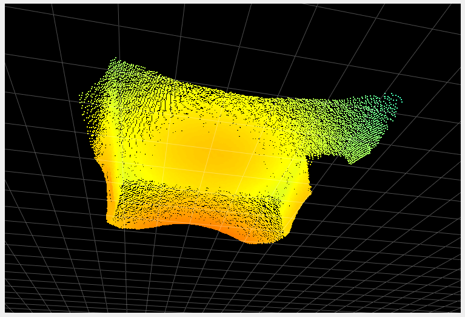
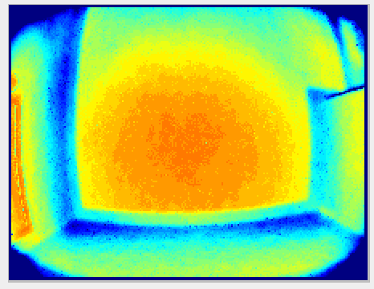
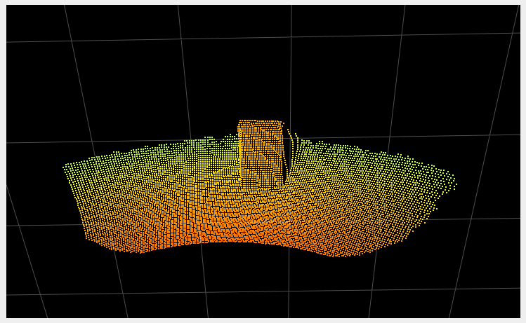

# Temporal filter

## Abstract
The temporal filter filters the data over, *you guessed it*, time. Each measurement per pixel over several frames is used to produce the filtered value, reducing (distance) noise per pixel.
This filter is best suited for static scenes, as the objects in the scene are in the same relative positions over multiple frames. 

## Description
The temporal filter affects all images,  i.e., distance image, point cloud, etc, by reducing the temporal and distance noise. The filtered value for each pixel at a certain time is computed by integrating information over multiple frames. There is no strict limit on of how many frames are taken into account for filtering, but instead the filter is automatically reset when necessary (for instance when motion is detected).

## Examples
### Reducing noise
The primary role of the temporal filter is to reduce noise. The images below show a before/after of a scene measured without (left images) and with (right images) the temporal filter. The two images in the second row represent the distance noise, the color black representing a negligible amount of noise, blue a noise of around 2cm. We can see that the noise is greatly reduced with the use of the temporal filter (it is even more visible "live", try it!).
||| |
|--|--|--|
|||

### Recovering lost pixels
Due to the fact that the filter estimates pixel values over time, a positive side effect is that it gathers more data overall. Certain pixels might reflect too little light, because of their distance to the camera or of their material, which causes them to be discarded during the filtering process (by the [spacial filter](bilateralFilter.md) for instance, or the [minimum amplitude filter](minAmplitude.md)). However, distance data for these pixels can potentially be computed from collecting light over multiple frames. In the two images below, we compare the same scene without (left image) and with (right image) the filter. We can see that a section of the floor (around 10 cm) at the end of the range (the pixels returning the least amount of light) is not visible without the temporal filter. Note that this section of the floor could also possibly be recovered using the [distance noise](maxDistNoise.md) with higher values for the distance noise threshold, with the disadvantage of increasing the overall noise.

|||
|--|--|

## Related settings
+ [Distance noise](maxDistNoise.md)
+ [Minimum amplitude](minAmplitude.md)
+ [Spacial filter](bilateralFilter.md)