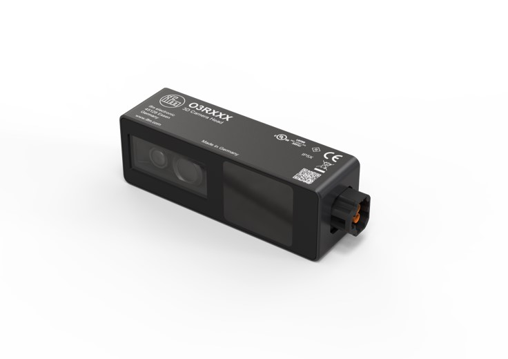
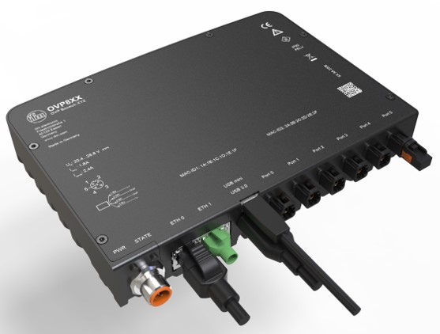
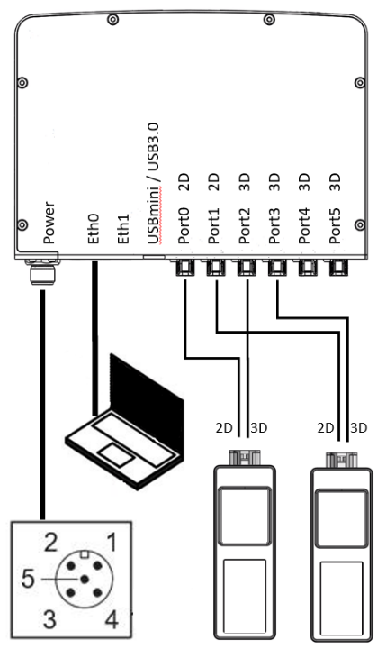

# Hardware unboxing

Check out our wiring video:
:::{youtube} msPANzaOuSY
:::

If you prefer to read, here are the steps to wire an O3R platform.
You need the following hardware from ifm:
- One or several camera heads (O3R222 or O3R225 for example),

- An OVP8xx (for example the OVP810), 

- One FAKRA cable for each camera head.

You also need:
- A reliable power supply capable of providing at least 24 V / 3.5 A
- An Ethernet cable rated for 1 Gbit/s (Gigabit) communication.

Then, follow the instructions below:

1. First, connect the heads to the VPU; the only requirement is to connect pairs of same imager types together, for instance as shown below:  
     

**Some example scenarios**

| Connection    | Port 0            | Port 1            | Port 2            | Port 3            | Port 4        | Port 5        |
| ------------- | ----------------- | ----------------- | ----------------- | ----------------- | ------------- | ------------- |
| **example 1** | camera 1 (3D)     | camera 2 (3D)     | camera 1 (2D)     | camera 2 (2D)     | camera 3 (3D) | camera 4 (3D) |
| **example 2** | camera 1 (2D)     | camera 2 (2D)     | camera 1 (3D)     | camera 2 (3D)     | camera 3 (2D) | camera 4 (2D) |
| **example 3** | camera 1 (3D)     | camera 2 (3D)     | camera 3 (3D)     | camera 4 (3D)     | camera 5 (3D) | camera 6 (3D) |
| **example 4** | camera 1 (3D-VGA) | camera 2 (3D-VGA) | camera 3 (3D)     | camera 4 (3D)     | -             | -             |
| **example 5** | camera 1 (3D-VGA) | camera 2 (3D-VGA) | camera 3 (3D-VGA) | camera 4 (3D-VGA) | -             | -             |

:::{note}
Please note that **38k(O3R222 / O3R225)** and **VGA(O3R252)** are different 3D image sensor types and should not be connected to same port pair.
:::

2. Connect power to the VPU, the pins are defined as follows:
   - 1 screen
   - 2 24 V
   - 3 GND
   - 4 CAN +
   - 5 CAN -
3. Connect the Ethernet cable,
4. Once all the connected cameras LEDs are green, the VPU is properly booted up.  

That's it!
