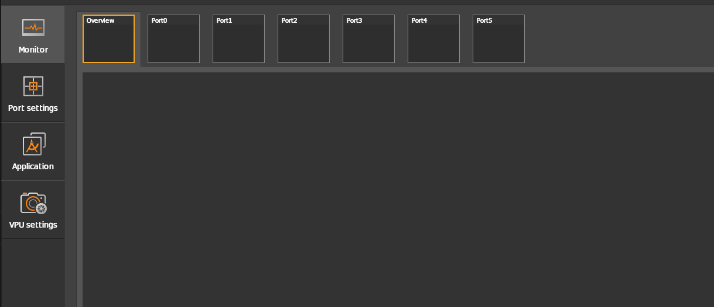
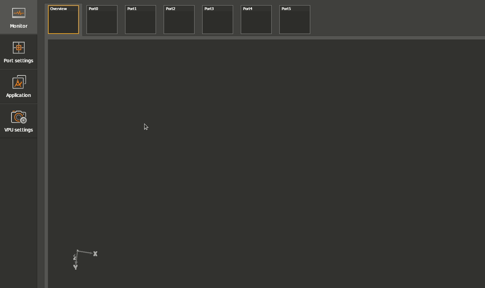

# First steps after the first initial connection

Next to unboxing and setting up of the O3R system, an initial test is beneficial. This can prove that the hardware is connected and working properly.

**Tip: When the hardware is not working properly, a firmware update might solve the issue. Please refer to the release notes and compatibility lists to see if the current installed firmware is suited for the currently used ifmVisionAssistant.**

## Activating the heads for 2D & 3D data acquisition

The first step to verify the overall functionality is setting all connected O3R-heads (for example O3R222/225) to "RUN" and receive 2D & 3D information.

A newly unboxed O3R system does not show anything in the monitor area - yet.

To set all heads at once to the "RUN state", it is necessary to switch to `Port settings` and use the `Set all ports to RUN state` button.
Please keep in mind that this is a Vision Assistant specific helper function, which isn't native to the underlying parameter JSON structure. Its working method is to iterate through every port and set its `state` to `RUN`.

If there are heads connected (listed in the `Port settings`), they will change from `CONF` to `RUN` and both a 2D and 3D image (if both ports from the respective head are connected) will be received by the ifmVisionAssistant.

A preview can be seen right above the "big" 2D/3D view area.

The main view typically shows the 3D point cloud data directly.

**Tip: It might be necessary to zoom (scroll) into the image. You can also use the mouse and the left button to change the view directions. The middle mouse button can be used to translate the point cloud relative to the visualization principal point.**

Switching between the ports at the preview area also changes the main view. This allows to inspect other ports and also 2D data.

If all connected heads provide an image - after they have been set to "RUN" (that is, continuous data acquisition) - the general hardware set up is working.

**Tip: There are several other possibilities to inspect the 2D & 3D data. It is also possible to change the parameters and see the effect within the view. See the following and/or official ifmVisionAssistant documentation for further information.**

**Showcase: Displaying the 2D data as an overlay with the 3D data**

This Vision Assistant specific feature overlays the 2D RGB data of the respective 2D imager to the 3D point cloud. The method used here is a simple pixel-to-pixel map (on an ordered point cloud), which IS NOT based on evaluating the optical model of 2D and 3D. Therefore is can only be used as a rough estimation of 2D to 3D mapping.

The 2D & 3D mapping might be changed in the future to take the optical models into account. Until then please refer to the Python example for a complete 2D RGB & 3D point cloud mapping.
