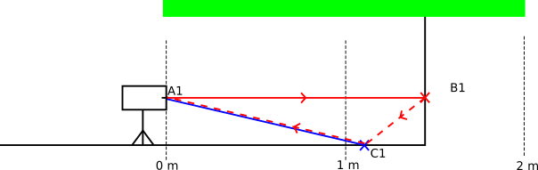

# Dealing with multi path interference

Multi path interferences (MPI) are well known for Time of Flight (ToF) systems. While MPI is a physics issue, we do our best to mitigate it and propose creative solution to circumvent it. In this document, we briefly explain what is MPI and its specificity for ToF systems using coded modulation. We then explore ways to mitigate MPI for mobile robots applications.

**Summary**
Blahblahblah

**Table of content**
1. MPI explained
    1. Normal MPI
    2. MPI with coded modulation
2. Mitigating MPI

## MPI explained
### "Normal" MPI
MPI is the result of the mixed measurement from directly reflected light (camera - object - camera) and indirectly reflected light (camera - other object - object - camera). This idea is simply explained in the following image. The ray of light expected for measuring the distance to C1 is depicted in blue. Another ray of light reflects against the wall in B1 and reaches the floor point C1 (depicted in red). The blue and red beams mix for the measurement to C1 and C1 is measured further than it actually is, resulting in a "dip" in the floor in front of the wall. 

An illustration of MPI artifact in the point cloud view is displayed below:

The strengh of MPI depends on the reflectivity of the surfaces at play, and on the geometric configuration of the objects (the angle from the camera to the floor, etc). Objects further away from the camera as well as darker / less reflective objects reflect less light and therefore are more impacted by a strong signal reflected from another source.

### MPI with coded modulation

With coded modulation technology, the camera only measures a set range of the scene (default range for the O3R are 0 to 2m and 0 to 4m). If we look at the schematic scene presented below, the measurement range is represented in green. The scene is the same as the one discussed before but the camera is placed slightly further away from the wall. The same phenomenon is present where the red and blue beams constitute the distance measurement for C1. However, in this scene, the distance A1B1C1 is longer than the 2m range. The means that the point C1's measurement will be pushed out of range from the interference from B1. 

In this case, the MPI will result in a "hole" (pixels out of range) instead of just a dip. The picture bellow illustrate this case:

## Hints for dealing with MPI
The two scenes presented above show typical cases of MPI. Let's see how we can smartly use the features of the O3R to mitigate this artifact.
### Intelligently using the offset and the range
The O3R comes with an setting that we are going to focus on here: the `offset`. With this setting we can shift the measurement range in space to measure for instance from 1 to 3m instead of 0 to 2m. This setting in itself will not solve our issue. This image below describes the MPI artifact in the scene with use of the offset: B1's reflected light can still impact the measurement of C1.

However, the offset can be shifted so that the wall is out of range, as depicted below.

In this case, B1 is outside of the measurement range and will therefore be ignored. The light reflected from B1 will have no impact and C1 will be measured properly. We mitigated the MPI artifact.

Of course, it is not always this simple to shift the range around and compare measurements to ensure the floor is indeed a flat floor and not a hole. This involved some awareness of the environment and localisation of the robot.