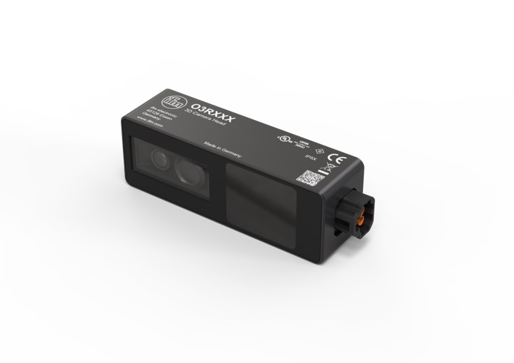

# How to: Unboxing O3R

## Hardware unboxing

If nobody tampered with your O3R package, you should have following hardware:
- Camera head (two of them if you ordered the developer kit)

- VPU (Video Processing Unit)  

- FPD cables to connect the head(s) to the VPU


You need a strong enough power source: 2.5A and 24V minimum.

1) First, connect the head(s) to the VPU; the only requirement is to connect pairs of same imager types together, for instance as shown below:  
  
2) Connect power to the VPU - <font color=red>ATTENTION: PIN2 is power! PIN3 is ground</font>   
3) Connect the ethernet cable (not included in the package)  
4) Wait until you see the ethernet LED flashing before pinging/connecting to the VPU.  

That's it about the hardware. Next step: software installation.


## Software installation

### For python

It's very simple: you can simple use `pip`:
```python
pip install ifm3dpy
```

### For cpp

You will need to build from source. Clone the [ifm3d repository](https://github.com/ifm/ifm3d/tree/o3r/main-next) from github (make sure to use the o3r/main-next branch) and proceed as follows:

```console
$ mkdir build 
$ cd build 
$ cmake -DCMAKE_INSTALL_PREFIX=/usr .. 
$ make 
$ sudo make install
```

To build the python bindings, use:
```console
$ cmake -DBUILD_MODULE_PYBIND11=ON ..
```

To build the examples, use:
```console
$ cmake -DBUILD_MODULE_PYBIND11=ON -DBUILD_EXAMPLES=ON ..
```

### For ROS: *coming soon*
