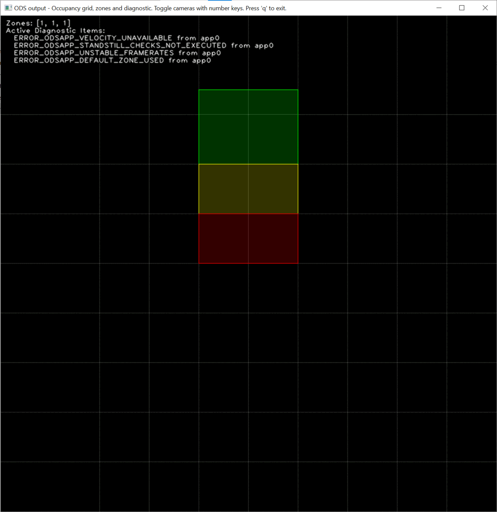

# How to switch cameras used for ODS

:::{note}
The support for camera switching within a single ODS instance was introduced for firmware version 1.1.X., alleviating the need to switch between instances of ODS as implemented in prior firmware.
:::

## Reconfigure application to use a different subset of ports

## Demonstration

Try `ods_demo.py` for an interactive demonstration of the camera switching. This will show active diagnostic messages and zone activation as well.



ODS running on the OVP801 or M04239 is currently limited to 3 cameras running simultaneously so switching active cameras is required to see in all directions for many vehicles vehicles. Additionally, selectively deactivating cameras provides of energy saving advantages as well.


```json title="Change active cameras while ODS is in sta"
# Update the app with a new set of active cameras and an updated set of zones
{
    "applications": {
        "instances": {
            "app0": {
                "configuration": {
                    "activePorts": ["port3"],
                "ports" : ["port0", "port1", "port2", "port3", "port6"],
                "state": "RUN"
                }
            }
        }
    }
}
```

:::{warning}
The set() function will throw an exception if the number of 3d ports specified in `activePorts` exceeds the `maxNumSimultaneousCameras` specified when the application was initialized or the 3d port was not present in the `ports` parameter of the application.
:::

# Update other aspects of the application in the same set() call

For implementations of the zones feature, it will be necessary to switch the active zones in addition to the active cameras.

In this case, the `maxHeight`, `zoneConfigID`, and `zoneCoordinates` are all changed in the same call as the `activePorts` call

```json title="Change active cameras while ODS is in sta"
# Update the app with a new set of active cameras and an updated set of zones
{
    "applications": {
        "instances": {
            "app0": {
                "configuration": {
                    "activePorts": ["port3"],
                    "grid": {
                        "maxHeight": 1.4,
                    },
                    "zones": {
                        "zoneConfigID": 20,
                        "zoneCoordinates": [
                            [[0.0,-1],[1.0,-1],[1.0,1],[0.0,1]],
                            [[1.0,-1],[2.0,-1],[2.0,1],[1.0,1]],
                            [[2.0,-1],[3.0,-1],[3.0,1],[2.0,1]],
                        ]
                    },
                }
            }
        }
    }
}
```