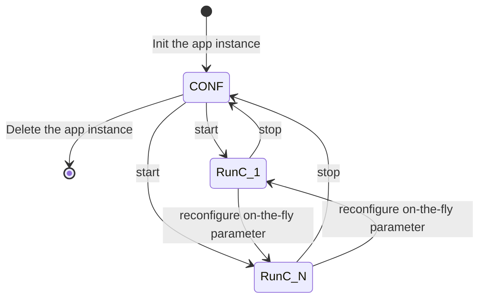
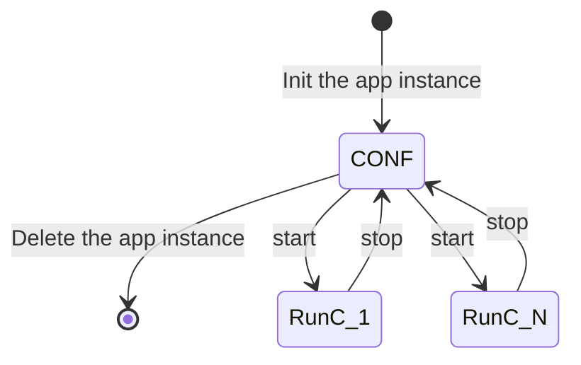

# ODS software integration guide:

This document can be understood as a guideline document and overview on how to integrate the O3R ODS system into a AGV / AMR software ecosystem.
In consists of multiple work items that need to be integrated for a fully functional and performant O3R collision avoidance system on an AGV.

This document links down to the respective standalone docs where ever possible and adds little additional information, but rather gives an overview of general ODS application workflows and work items.

**ODS application creation and configuration**
ODS application instance creation
ODS application parameter changes
ODS application lifetime management

**ODS data retrieval**
Overview of the API
ODS available data streams
ODS zone data retrieval
ODS zone data reaction
ODS occupancy grid data retrieval
ODS occupancy grid data reaction

**Diagnostic retrieval**
Diagnostic message retrieval
Diagnostic message reaction strategy

**Calibration of the O3R devices**
Calibration of the O3R camera(s)
Calibration of the O3R VPUs IMU

## ODS app instance creation and configuration

### ODS application instance creation
An ODS application instance can be created using the regular ifm3d API JSON get, set functionality.
The creation of a ODS application is described in more detail in the document [configuration](./configuration.md).

When ever creating an ODS app, keep in mind that only one ODS app instance can be created at a time.
If you need to clear out old app instances have a look at the section [ODS application lifetime management](#ods-application-lifetime-management).

### ODS application parameter changes

The following guide should show how to create and manage ODS application parameters.

**`non-CONF` parameters**
These parameters can be changed on the fly, just like any other camera parameter.
The corresponding state change diagrams look like this:

The corresponding `CONF-only' parameters under the `applications' JSON element are **NOT** changed automatically.

Any parameters marked as [`CONF` parameters](configuration.md#conf-only-parameters) in the application JSON Schema require an explicit user state change to CONF to become available.

The corresponding state diagram looks like this:

### ODS application lifetime management