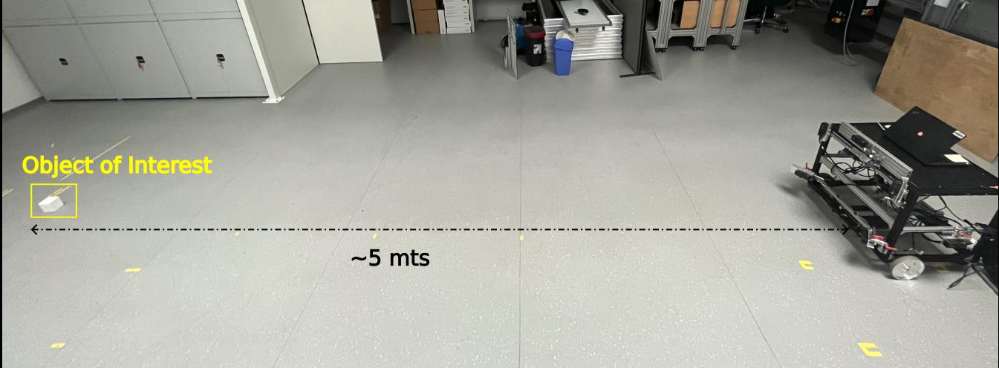
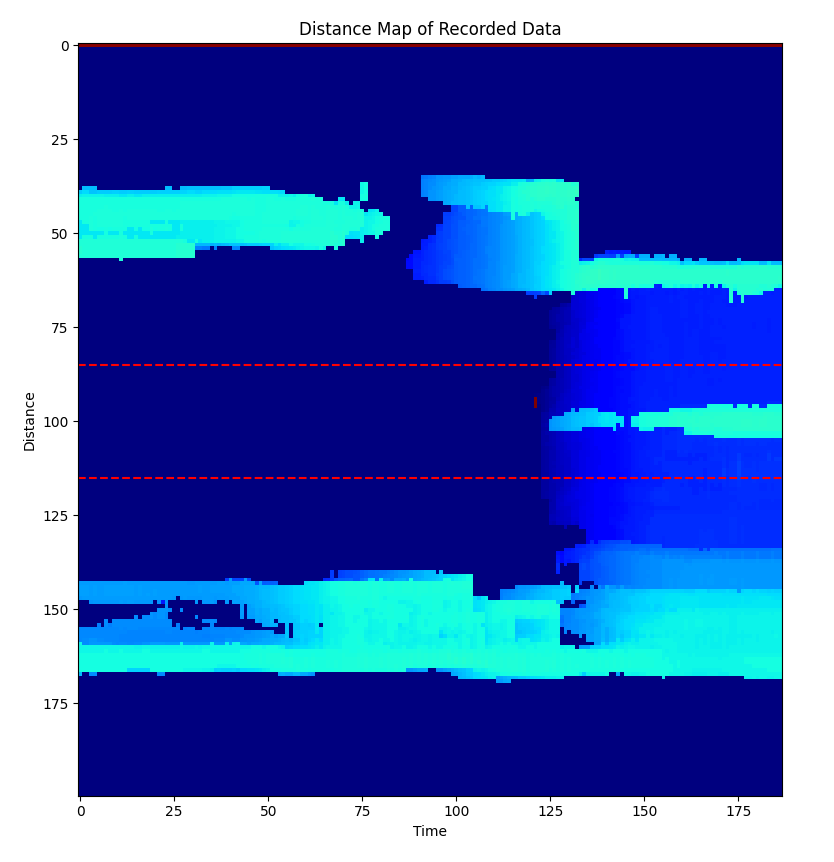
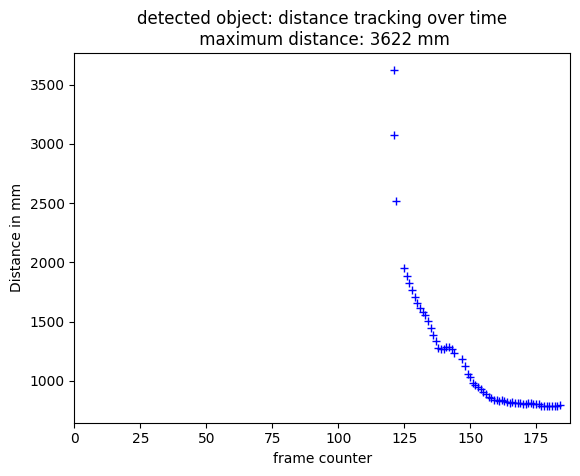

# ODS Performance evaluation

The O3R-ODS performance for an AGV depends upon various factors. This whitepaper gives presents a evaluation strategy for benchmarking

## ODS Performance analysis

### How to read the data
Please refer to the [iVA ODS recording documentation](../../Recording/ods_data_recording.md#ifmvisionassistant) to find out more details on how to record and import our open source hdf5 data files.

-----

### How to analyze the data

**At which frame the object is detected**

The code snippet below serves as an example to analyze the data recorded during a robots parkour run.
The following code snippet analyzes the True Positive Test case i.e the maximum distance between the vehicle and the object when it is detected by the ODS system.


**Test Scenario:**

- Place an object of interest at a distance of 5 m - 7 m from the robot: that is enough free space wo an object in front of the camera
- Launch the ODS application instance via ifm Vision Assistant (iVA)
- and start recording
- Driving the robot towards the object at the desired speed: testing multiple speeds, especially for smaller objects close to the floor might be beneficial for understanding the ODS performance limits.

**Test Scenario**



**Camera Mounting Height**

This is an exemplary test case: please see the mounting guide for suggested mounting positions and heights.


Below you can find an exemplary output of data as streamed and displayed using the iVA.

| RGB STREAM                        | ODS STREAM                        |
| --------------------------------- | --------------------------------- |
|  |  |

**Question:**

In the recorded data, at which frame does ODS detect the obstacle. Provide the distance from user coordinate-system origin (that is robot location) to the object.
Please find the script to reproduce the following images from the recorded data.

```python title="Plot a distance map representation of the occupancy grid"
## create a distance map based on the recorded data occupancy grid data

def get_distance_map_data(stream_ods):
    """
    Input: ODS data stream
    Output: Distance Map (Time vs Distance), Frames where the Object is detected in ROI
    This function reads the ods data stream from recorded data and
    outputs an image
        - where each column represents the each occupancy grid in a stream
        - Each row in a column of distance map represents the first non-zero value
                (if exists) along the each row in a Occupancy Grid

    """

    #  Array of all Occupancy grids in a stream_ods
    occupancy_grids_array   = np.array(stream_ods[:]['image'])
    total_occupancy_grids   = occupancy_grids_array.shape[0]

    rows_in_occupancy_grid  = occupancy_grids_array.shape[1]

    #  We are interested in frame when the object is detected in ROI
    frames = []
    distance_map            = np.zeros(occupancy_grids[:,0,:].shape)

    for occupancy_grid in range(total_occupancy_grids):
        for row in range(rows_in_occupancy_grid):

            # check for  a non-zero value in each row
            idx=np.nonzero(occupancy_grids_array[occupancy_grid,row,:]>127)[0]

            if idx.size==0: # No non-zero value found in a row of occupancy grid
                distance_map[occupancy_grid,row]=200
            else:
                distance_map[occupancy_grid,row]=idx[0]
                if (85 <= row <= 115): # ROI is considered as 85 to 115 rows in occupancy grid
                    frames.append(occupancy_grid)

    distance_map    = -distance_map

    return distance_map


distance_map = get_distance_map_data(stream_ods)

plt.figure()
plt.imshow(distance_map.T,cmap='jet',interpolation='none')
# Plot ROI
plt.axhline(85, color='r', linestyle = 'dashed')
plt.axhline(115,color='r', linestyle = 'dashed')
plt.xlabel('Time')
plt.ylabel('Distance')
plt.title('Distance Map of Recorded Data')
```

-----

**Output:**


### False positive evaluation


Above the distance map representation of the recorded ODS data is show.

This distance map is a representation of closest non zero distance per occupancy grid row (that is movement direction) over time. This representation takes a bit of time to get used to but gives a compact representation of object distance as color information over time per geometric Y-location.

If high color differences (for example "color contrasts") appear, this is equivalent to quick change of object distance at that location. Non-continuous color changes indicate that the detected object distance changes quickly over frame counter, i.e:
- the object detection was "just picked up on"
- the object detection was lost, for example the object left the field of view
- the object might not be a true positive, but a false positive, for example a point cloud or occupancy grid artifact


**Example evaluation of this distance map and occupancy grid**

From output above, we can say that the object started to appear in the occupancy grid from frames between 125 to 140. We see there are no non-zero values in the Region of Interest (`ROI`) until the obstacle is detected and this can deduce that there are no false positives detected in the data. The following snippet plots the 16 occupancy grids (8 Occupancy grids before and after object detection in `ROI`)

```py title="plot a sequence of occupancy grid images"

# create an empty figure object
plt.figure()

range_occ_grids=np.arange(frames[0]-8,frames[0]+8)
for i,frame in enumerate (range_occ_grids):

    plt.subplot(4,4,i+1)
    plt.imshow(stream_ods[frame]['image'],cmap='gray',interpolation='none')
    plt.axhline(85, color='r', linestyle = 'dashed')
    plt.axhline(115,color='r', linestyle = 'dashed')
    plt.colorbar()
    if frame == frames[0]:
        plt.title(f'Object detected in frame {frame}')
    else:
        plt.title(f'Frame {frame}')
```


**Output**
-------



The following script shows how to track the distance between the User-Coordinate-System and first object detected in ROI.

```{literalinclude} /code_examples/Python/ODS/ods_data_analyze.py
```
