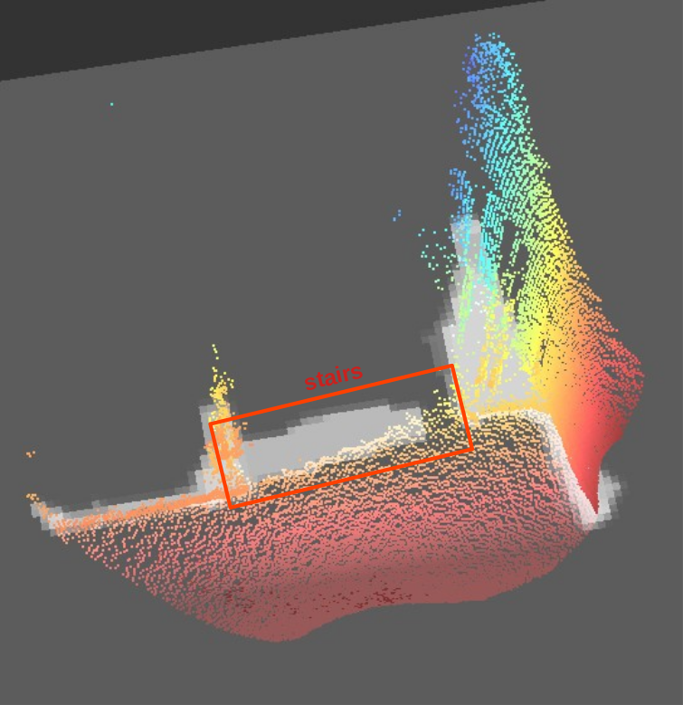
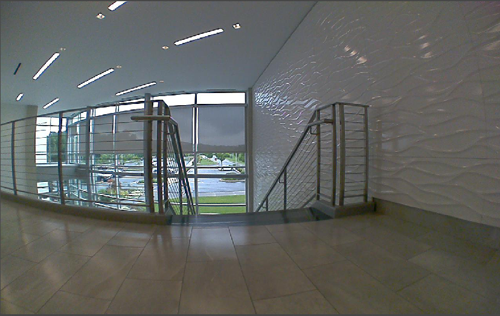

# Negative obstacles

:::{note}
This feature was added in firmware version 1.1.x.
:::

ODS has the capability to detect negative obstacles, that is obstacles that are below the floor plane (holes, stairs, downward ramps, etc).

## Prerequisites and limitations

To the ODS app, a negative obstacle is defined as:
- At least 20 centimeter large along the X axis,
- At least 20 centimeter large along the Y axis,
- If the bottom of the negative obstacle is detected, it must be at least 20 centimeters below the floor plane.

:::{note}
We are using here the "robot" coordinate system: the X axis is pointing in the robot main driving direction, the Z axis is pointing upwards. The floor plane is defined by `Z=0`.
:::

Negative obstacles will not be detected equally well in all mounting positions. Due to the angle at which light is reflected from the ground, more or less range can be achieved for ground detection. Negative obstacle detection relies in part on being able to see pixels that belong to the ground, so in cases where range is limited, performance will be reduced.
For more details on mounting recommendations, refer to the [mounting documentation](../Mounting/mounting.md).

Due to the variability in true positive detections depending on the mounting position and the environment, we strongly encourage the user to perform tests in their facility. Take a look at our documentation about [performance verification](../FieldTest/PerformanceVerification/ods_performance_verification.md) and about the possible [iToF artifacts](../FieldTest/TOFArtifacts/ods_tof_artifacts.md) you can encounter.

## Enable the negative obstacle detection

Negative obstacle detection must be enabled for each individual port where floor is in the field of view. This feature is disabled by default.

The JSON below shows the `enableNegativeObstacles` parameter to consider to enable this feature for port0 (change the port number to fit your configuration):
```json
{
    "applications":{
        "instances":{
            "port0":{
                "negObst": {
                  "enableNegativeObstacles": true
                }
            }
        }
    }
}
```

The negative obstacle detection is a feature that [requires a switch to "CONF" state](../../Technology/configuration.md#conf-only-parameters) to be enabled.

In python, for example, the feature can be enable with the code below. Note that this code assumes the existence of an `app0` instance using a camera connected to `port0`.

```python
# 1. Set the application to "CONF" state
o3r.set({"applications": {"instances": {"app0": {"state": "CONF"}}}})

# 2. Enable the negative obstacle feature
o3r.set({"applications":{"instances": {"app0":{"port0":{"negObst": {"enableNegativeObstacles": True}}}}}})

# 3. Set the application instance back to RUN state
o3r.set({"applications": {"instances": {"app0": {"state": "RUN"}}}})
```

## Negative obstacles in the occupancy grid

Negative obstacles will appear on the occupancy grid just like other obstacles do. Once the occupancy grid is constructed, there is no way to differentiate what obstacle is above or below the floor plane.

In the image below, we show the point cloud and occupancy grid corresponding to a staircase surrounded by a railing.

| Point cloud and occupancy grid view | Corresponding RGB image |
| ----------------------------------- | ----------------------- |
|  |  |