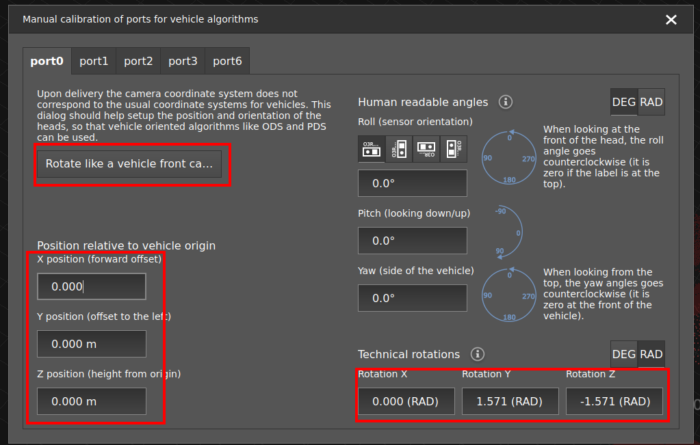

# Camera calibration for PDS

The PDS application always returns the position of an object with respect to the fork tines coordinate system.
The camera position and orientation is defined by the parameters in `portX/processing/extrinsicHeadToUser`.

By default, PDS expects:
- The camera to be placed between 22 and 35 cm above the bottom plane of the pallet,
- The orientation of the coordinate frame to match the world coordinate system, that is X pointing forward and Z up.

Consequently, if no calibration is set, PDS will raise an error.

This means that a horizontally mounted camera (label on top, cables on the left) should be calibrated as follows:  



This is equivalent to setting the following parameters in the relevant port's JSON configuration:
```json
{
    "ports":{
        "portX":{
            "processing":{
                "extrinsicHeadToUser":{
                    {
                        "rotX": 0,
                        "rotY": 1.57,
                        "rotZ": -1.57,
                        "transX": 0,
                        "transY": 0,
                        "transZ": 0
                    }
                }
            }
        }
    }
}
```
:::{note}
Make sure to update the `rotX`, `rotY`, and `rotZ` for cameras mounted vertically or in a different orientation. You can use the [calibration cheat sheet](/SoftwareInterfaces/Toolbox/IntroToCalibrations/calibration_cheat_sheet.md) as a reference, or use the calibration wizard in the Vision Assistant.
:::

The translations `transX`, `transY` and `transZ` should be left at zero. This is due to:
- the fact that the camera is expected to move up and down along with the forks, which makes the `transZ` value irrelevant,
- the `(X, Y, Z)` position of the camera is provided in reference to the camera center, which makes the camera's `transX` and `transY` irrelevant in the world coordinate system.

Note that errors in the camera calibration will lead to errors in the position of the targeted object. If CAD data is known to be precise enough, it can be used to extract calibration values for the camera. Otherwise, any of [the calibration methods](/SoftwareInterfaces/Toolbox/ExtrinsicCalibration/README.md) provided by ifm can be used.