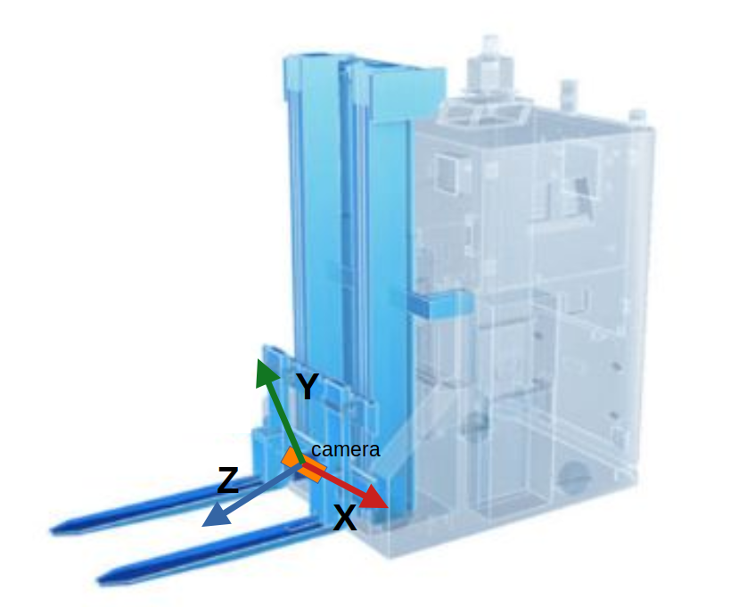
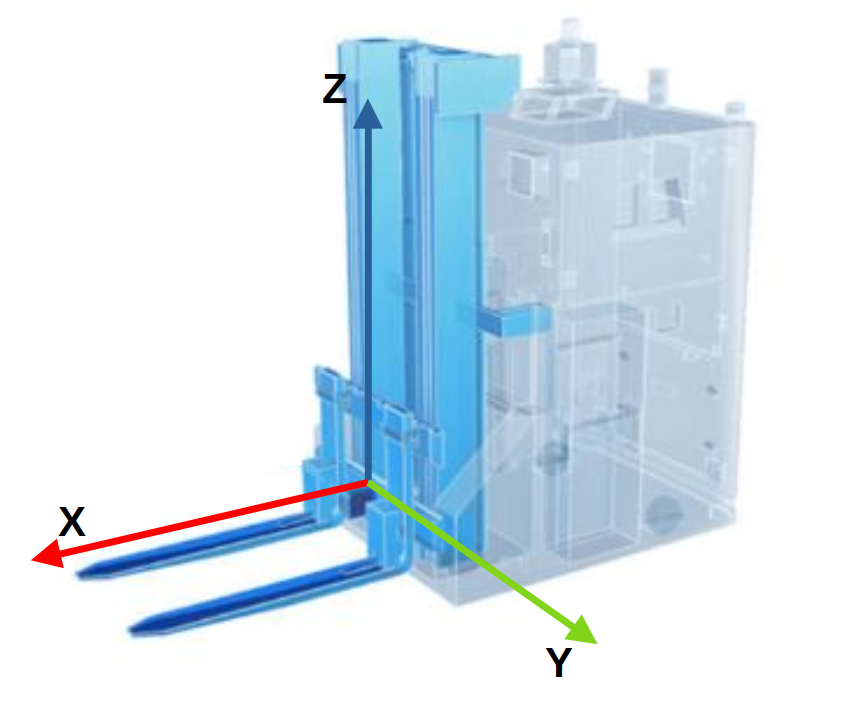

# Camera calibration for PDS

The PDS application always returns the position of an object with respect to the calibrated coordinate system. Typically, the calibrated coordinate system corresponds to the fork tines, so that the coordinate system will go up and down with the forks and the pallet position will always be provided with reference to the current position of the forks.

## Orientation

PDS expects the orientation of the coordinate frame to be as follows:
- X is pointing in direction of the forks,
- Y is pointing to the left of the forks,
- Z is pointing up.

When uncalibrated, the camera coordinate system is such that Z is pointing away from the camera, and X is pointing away from the cables. This is represented in the image below:



The uncalibrated coordinate system does not correspond to what PDS expects. Consequently, if no calibration is set, PDS will raise an error.

To fit the expected coordinate system of PDS, the coordinate system has to be rotated. An example of a correctly calibrated coordinate system would be as shown in the image below, where the origin of the coordinate system is place at the center of the base of the forks:



Note that the user can decide where to place the origin of the coordinate system. We show a couple examples [below](#examples).

## Translation
PDS will look for a pallet within a defined volume of interest. By default, it expects the camera to be placed between 22 and 35 cm above the bottom plane of the pallet.  


## Examples
This means that a horizontally mounted camera (label on top, cables on the left) should be calibrated as follows:  


This is equivalent to setting the following parameters in the relevant port's JSON configuration:
```json
{
    "ports":{
        "portX":{
            "processing":{
                "extrinsicHeadToUser":{
                    {
                        "rotX": 0,
                        "rotY": 1.57,
                        "rotZ": -1.57,
                        "transX": 0,
                        "transY": 0,
                        "transZ": 0
                    }
                }
            }
        }
    }
}
```
:::{note}
Make sure to update the `rotX`, `rotY`, and `rotZ` for cameras mounted vertically or in a different orientation. You can use the [calibration cheat sheet](/SoftwareInterfaces/Toolbox/IntroToCalibrations/calibration_cheat_sheet.md) as a reference, or use the calibration wizard in the Vision Assistant.
:::

The translations `transX`, `transY` and `transZ` should be left at zero. This is due to:
- the fact that the camera is expected to move up and down along with the forks, which makes the `transZ` value irrelevant,
- the `(X, Y, Z)` position of the camera is provided in reference to the camera center, which makes the camera's `transX` and `transY` irrelevant in the world coordinate system.

Note that errors in the camera calibration will lead to errors in the position of the targeted object. If CAD data is known to be precise enough, it can be used to extract calibration values for the camera. Otherwise, any of [the calibration methods](/SoftwareInterfaces/Toolbox/ExtrinsicCalibration/README.md) provided by ifm can be used.