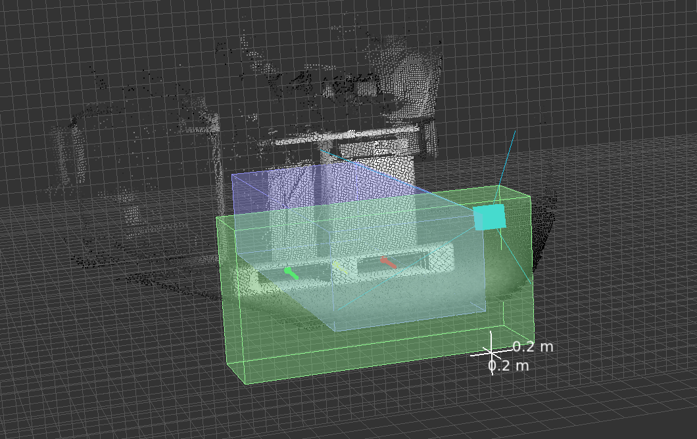

# `getPallet`

The `getPallet` functionality of PDS is designed to detect the position and orientation of up to 10 pallets in the vicinity of autonomous and semi-autonomous pallet handling vehicles. Typically, such a system has a priori knowledge from warehouse management, such as the approximate distance to the pallet and the type of pallet.

`getPallet` supports the picking operation by determining the exact location and orientation of the pallet.

## Usage guidelines
The typical use cases for `getPallet` are pallets with two pockets, either with broad blocks or thin stringers as vertical support structures.

PDS is able to detect pallets with the following characteristics:
- For a block-type pallet:
    - The pockets should be between 0.24 and 0.44 m,
    - The blocks should be between 0.05 and 0.4 m.
- For a stringer-type pallet:
    - The pockets should be between 0.4 and 0.48 m,
    - The stringers should be between 0.02 and 0.08 m.

Two pocket pallets with different dimensions than the ones stated above will require specific configuration of the algorithm. Reach out to your ifm representative or to the support team for more details.

## Input

### `depthHint`
The depth hint is the approximate distance (in meters along the X axis) between the origin of the fork tines coordinate system and the pallet. Providing an accurate depth hint allows the algorithm to target a specific area of the scene for the pallet detection and speeds up processing times.
Zero or a negative value can be passed to use automatic distance detection. Note that automatic detection works best with fully loaded pallets and will most likely fail with empty pallets.

### `palletIndex`

Input the pallet index based on the pallet type.

| Pallet Index | Pallet type |
| ------------ | ----------- |
| 0 (default)  | `Block`     |
| 1            | `Stringer`  |
| 2            | `EPAL side` |

Other variants of pallets, having three or more pockets for example, require adjustments of the PDS settings. Reach out to your ifm representative or to the support team for more details.

### `palletOrder`
If multiple pallets were detected in the field of view, you can set the order of pallets based on three properties:
- `scoreDescending` (default): the pallet order will be based upon the detection score (highest to lowest), which corresponds to how well the pallet matches the expected pallet shape,
- `zAscending`/`zDescending`: the pallet order will be based upon the height from the floor, that is, along the calibrated Z axis (`zAscending` - lower to upper, `zDescending` - upper to lower).

## Output

| Name                 | Type              | Description                                                                                      |
| -------------------- | ----------------- | ------------------------------------------------------------------------------------------------ |
| `numDetectedPallets` | `uint32`          | Number of valid pallets in the FOV (up to 10)                                                    |
| `pallet`             | `PalletDetection` | Information about the pallet's pose. The structure of the `PalletDetection` type is given below. |

### `PalletDetection` structure
| Name     | Type                 | Description                                    |
| -------- | -------------------- | ---------------------------------------------- |
| `score`  | `float32`            | Detection score of the pallet [0..1]           |
| `center` | `DetectedPalletItem` | Position and size of the pallet's center block |
| `left`   | `DetectedPalletItem` | Position and size of the pallet's right pocket |
| `right`  | `DetectedPalletItem` | Position and size of the pallet's left pocket  |
| `angles` | `Angles3D`           | Rotation angles of the pallet                  |

#### `DetectedPalletItem` structure
| Name       | Type         | Description                       |
| ---------- | ------------ | --------------------------------- |
| `position` | `Position3D` | Cartesian coordinates of the item |
| `width`    | `float32`    | Width of the item in meters       |
| `height`   | `float32`    | Height of the item in meters      |

##### `Position3D` structure
| Name | Type      | Description                      |
| ---- | --------- | -------------------------------- |
| `x`  | `float32` | Cartesian X coordinate in meters |
| `y`  | `float32` | Cartesian Y coordinate in meters |
| `z`  | `float32` | Cartesian Z coordinate in meters |

#### `Angles3D` structure

| Name   | Type      | Description                       |
| ------ | --------- | --------------------------------- |
| `rotX` | `float32` | Rotation around X axis in radians |
| `rotY` | `float32` | Rotation around Y axis in radians |
| `rotZ` | `float32` | Rotation around Z axis in radians |

## `getPallet` volumes of interest

The `getPallet` command expects the pallet to be in front of the robot and in the field of view of the camera, as illustrated below. 

The `getPallet` command works as follows:
1. If the `depthHint` is set to a positive value (this is the recommended option), the user is expected to have a priori knowledge about where the pallet is with respect to the robot coordinate reference frame. In this case, the pallet's pose estimation is performed inside the `projection volume`, which is set at the `depthHint` including +/- 0.2 m.
2. If the `depthHint` is set to zero or a negative value, then the pallet will be searched for in the `depth estimation volume`. Once the distance to the pallet is estimated, the `projection volume` is set at this distance including a +/- 0.2 m buffer in X direction on each side. The pixels in the `projection volume` will be used to estimate the position of the pallet.

For better understanding please see the figure below where the green box represents the `projection volume` and the blue box represents the `depth estimation volume`.

### Camera position and projection volume

The projection volume of the `getPallet` command uses the reference coordinate system, which in our case is the RCS (Robot Coordinate System). The default values of the projection volume are displayed in the figure below.

::{note}
It is important to note that the projection volume will be perpendicular to the X axis of the reference coordinate system.
If the camera is mounted sideways on the robot, meaning the projection volume should be perpendicular to the robot's Y axis, the projection volume will be incorrect. 
To solve this issue, please get in contact with the ifm support team for instructions on how to edit the projection volume.
:::

## Python example

To initialize and configuring the PDS application to execute `getPallet` command, please see the code example below.

:::{literalinclude} ../Python/getPallet.py
:caption: getPallet.py
:language: python
:::