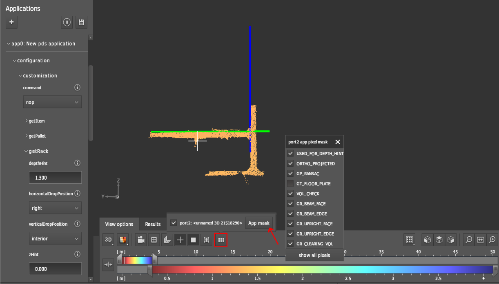

# getRack

The `getRack` functionality of PDS is designed to help an AGV to safely place a pallet/load into a standard racking system. The `getRack` function has two phases.
   1. 6-DoF transformation from the camera frame to the racking coordinate system, allowing the AGV control system to account for any errors in navigation, mast
deflection due to the mass of the load, or any other sources of positional error.
   2. Perform a volume sweep (in the racking coordinate frame) for a specified volume to check and flag for any obstacles present within the desired rack position.

In the above picture, the vertical blue line is the estimated upright structure and the horizontal green line is the estimated horizontal beam(a support structure of racking systems where the pallets will be placed.)

In the `View options` tab under the display window, you can enable the pixel masks to show which pixels to be displayed by clicking on `app mask` option.

## Input

### `depthHint` 
The Depth Hint is an approximate distance (distance in meters along the x-axis) that the camera is expected to be away from the item. The default value is **1.8** which can be has to be configured based on the actual approximate distance.

### `horizontalDropPosition`
The drop operation of the pallet is based on the `horizontalDropPosition` parameter. There are three configurations available for this parameter.

- `left`: if the drop operation has to take place on the left side of the shelf. The left upright of the rack is considered as a reference.
- `right`: if the drop operation has to take place on the right side of the shelf. The right upright of the rack is considered as a reference.
- `center`: if the user wishes to drop the pallet in the center.

### `verticalDropPosition`
This parameter informs the PDS about the drop information of the pallet. Depending on the drop vertical drop position, this parameter can be configured as 

- `interior`(default): If the pallet has to be dropped on the interior shelf which is one or more levels off the ground.
- `floor`: If the drop operation is to take place directly on the floor or on a bottom shelf that is very near to the floor.

### `zHint`
The Z-Hint is the approximate expected height (distance in meters along the z-axis) of the front beam with respect to the camera’s optical center. GetRack uses this value to optimize the search volume (and thus performance). The Z-Hint should be within +/- 0.4m of the true height of the front beam.

### `clearingVolume` 
Volume to sweep for obstacles with respect to the established origin of the racking system. These values will typically be obtained from warehouse management and will correspond to the approximate volume of the load to be placed.

## Output
| Name      | Type         | Description                                                                                    |
| --------- | ------------ | ---------------------------------------------------------------------------------------------- |
| score     | `float32`    | Detection score of the rack [0..1]                                                             |
| position  | `Position3D` | Position of the rack coordinate system origin                                                  |
| angles    | `Angles3D`   | Rotation of the rack coordinates system                                                        |
| side      | `char[25]`   | Type of the rack coordinate system. Either "right" for right-handed or "left" for left-handed. |
| numPixels | `uint32_t`   | Number of pixels inside the shelf volume of interest                                           |
| flags     | `uint32_t`   | Bitmask with debugging information for GetRack                                                 |

### `Position3D` structure
| Name | Type      | Description                      |
| ---- | --------- | -------------------------------- |
| x    | `float32` | Cartesian x coordinate in meters |
| y    | `float32` | Cartesian y coordinate in meters |
| z    | `float32` | Cartesian z coordinate in meters |

### `Angles3D` structure

| Name | Type      | Description                       |
| ---- | --------- | --------------------------------- |
| rotX | `float32` | Rotation around x-axis in radians |
| rotY | `float32` | Rotation around y-axis in radians |
| rotZ | `float32` | Rotation around z-axis in radians |

### Flags

| Bit No. | Name                | Description                                                                                                                                  |
| ------- | ------------------- | -------------------------------------------------------------------------------------------------------------------------------------------- |
| 0       | `NO_BEAM`           | The horizontal beam of the rack grid location could not be segmented                                                                         |
| 1       | `MULTIPLE_BEAMS`    | Multiple horizontal beam candidates were segmented, the most plausible was selected                                                          |
| 2       | `BEAM_COVERAGE`     | A threshold of pixel coverage over the surface area of the beam was not met                                                                  |
| 3       | `NO_UPRIGHT`        | A vertical upright was not detected, the rack frame was established based on the segmented beam, sweeping volume, and (optionally) the floor |
| 4       | `MULTIPLE_UPRIGHTS` | Multiple upright candidates (on the anchor side of interest) were segmented, the most plausible was selected                                 |
| 5       | `UPRIGHT_COVERAGE`  | A threshold of pixel coverage over the surface area of the upright was not met                                                               |
| 6       | `NO_JOIN`           | The beam and the upright used to establish the rack frame do not intersect in the point cloud                                                |
| 7       | `BAD_TRANSFORM`     | The origin of the computed rack frame is outside of an expected tolerance (indicative of a beam-only localization anchoring to an obstacle)  |
| 8       | `SHELF_OBSTACLE`    | An obstacle was detected within the shelf sweeping volume with respect to the established rack frame                                         |

The resultant flag value is a decimal value and has to be converted to binary value to know which flags were set to **1**. If the value of the flag is set to **384** then the resultant binary value is `11000000` i.e. bit numbers 8 and 9 were set to *1* (`BAD_TRANSFORM` and `SHELF_OBSTACLE`).

In the below section, the possible reasons why the flags are set are discussed in detail.

#### `NO_BEAM`

The horizontal beam of the rack grid location could not be segmented (this is a 'hard' error). Possible reasons/observations are:
   1. Incorrect depthHint: The algorithm looks for the beams around the given depth hint.  The tolerance for depth hint **0.23 m**
   2. Incorrect Z-Hint: The algorithm looks for beams around Z-Hint (tolerance: +/- 0.4m)
   3. No beam candidate meets the minimum length requirement: The algorithm looks for beams with a minimum length of 1.0 m.
   4. No beam candidate meets min/max height requirement: The algorithm looks for beams with a minimum / maximum height of 6 / 15 cm.

#### `MULTIPLE_BEAMS`

Multiple horizontal beam candidates were segmented, and the one with the largest extent in the y-direction was selected. Possible reasons/observations are:
   1. Loaded pallet or other obstacle above or below beam.
   2. True second beam in the scene.
   3. More than one beam candidate meets the minimum length and minimum/maximum height requirements.

#### `BEAM_COVERAGE`

A threshold of pixel coverage over the surface area of the beam was not met. Possible reasons/observations are:
   1. The segmented beam has lots of non-planar points.
   2. The segmented beam does not meet the minimum coverage requirement.

#### `NO_UPRIGHT`

A vertical upright was not detected, and the rack frame was established based on the segmented beam, sweeping volume, and (optionally) the floor. Possible reasons/observations are:
   1. Incorrect `horizontalDropPosition`: The algorithm looks to either the right side or left side, not to both sides except `horizontaDropPosition = Center`.
   2. No upright close to the beam.
   3. No upright candidate meets the minimum length requirement: The algorithm looks for uprights with a minimum length of 0.6m.
   4. No upright candidate meets the minimum/maximum width requirement: The algorithm looks for uprights with a minimum/maximum width of 3/12cm.

#### `MULTIPLE_UPRIGHTS`

Multiple upright candidates (on the anchor side of interest) were segmented. The leftmost or the rightmost was selected, depending on the `horizontalDropPosition`. Possible reasons/observations are:
   1. Loaded pallet or other obstacle above or below beam
   2. True second upright in the scene.
   3. More than one upright candidate meets the minimum length and minimum/maximum width requirements.

#### `UPRIGHT_COVERAGE`

A threshold of pixel coverage over the surface area of the upright was not met. Possible reasons/observations are:
   1. The segmented upright has lots of non-planar points.
   2. The segmented upright does not meet the minimum coverage requirement (after 3D plane fit).
<!-- 
:::{note}
   If `NO_UPRIGHT` flag is set, then `UPRIGHT_COVERAGE` is also set. -->

#### `NO_JOIN`

The beam and the upright used to establish the rack frame do not intersect in the point cloud. Possible reasons/observations are:
   1. The segmented beam and segmented upright do not intersect.

<!-- :::{note} 
   If `NO_UPRIGHT` flag is set, then `NO_JOIN` is also set. -->

#### `BAD_TRANSFORM`

The origin of the computed rack frame is outside of an expected tolerance (indicative of a beam-only localization anchoring to an obstacle). Possible reasons/observations are:
   1. Position of selected upright deviates from expected position (only y-coordinate is considered): The algorithm expects the upright to be within tolerance on either the left side or right side.

#### `SHELF_OBSTACLE`

An obstacle was detected within the shelf sweeping volume with respect to the established rack frame. Possible reasons/observations are:
   1. The obstacle was detected within the shelf clearing volume: The algorithm checks the specified shelf clearing volume (defined with respect to the rack origin) for obstacles.