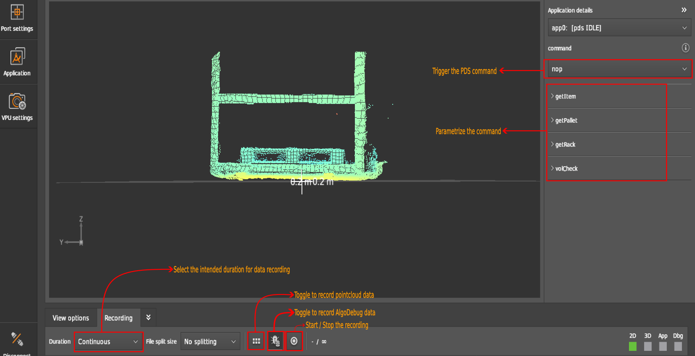

# Getting started with PDS

## Prerequisites

It is expected that a running O3R system (VPU and heads) is connected. Please refer to the [unboxing section](../../GettingStarted/Unboxing/hw_unboxing.md).

A typical procedure for getting started would be as follows
+ Connect M04311-VPU to `O3R222` camera head and power supply
+ Power up the system
+ Connect to ifmVisionAssistant (iVA)
+ Verify that live images are being received

## Calibrate the camera

The standard O3R coordinate system is right-handed, with
* x-axis points in the opposite direction to the FAKRA connector
* y-axis points "up".
* z-axis points away from the camera (depth).

For PDS, this coordinate system is rotated to match the user/robot coordinate system.
* x-axis points away from the camera
* y-axis points to the left, and
* z-axis points up

A new feature is introduced in the latest ifmVisionAssistant (iVA), which allows the user to manually calibrate the cameras mounted on the vehicle with respect to the user/robot coordinate system using `Manual calibration of ports for vehicle algorithms`.

**Procedure:**

1. Click on `Manual calibration of ports for vehicle algorithms` under `Port settings` window.
    ```{image} resources/step_1_iva_man_calibration.png
   :alt: Step 1
   :width: 800px
   :align: center
   ```
2. Select the port to calibrate
3. Select the orientation of the mounted camera when looking at the front of the camera.
4. Enter the translation parameters, i.e. the translation distances from the user/robot coordinate system to the camera.
5. Finally, click `Rotate like a vehicle front camera` to calibrate.
    ```{image} resources/step_2_to_5_iva_man_calibration.png
   :alt: Step 2 to Step 5
   :width: 400px
   :align: center
   ```

## PDS with ifmVisionAssistant

Before reading this section, make sure you are familiar with the documentation page: [how to get started with the iVA](../../GettingStarted/ifmVisionAssistant/index_iVA.md).

1. Extrinsic calibration is a necessary step before creating a PDS application. Follow the instructions above to calibrate the cameras manually.
2. To create a PDS application instance, click on the `Application' window and click on **+** to create a new application.
3. Select the port in the `Ports` section which is used by PDS application.
4. Change the state of the application from `CONF` to `IDLE`.
   
   

5. In PDS, only one command can be executed at a time. Customize the PDS parameters for the command to be executed.
6. Trigger the command in `Customization/Command` section. The default command has `nop` value. After processing the given command, it returns to its default command value. 
7. View results in the display.


:::{note}
   Click on the `Results` tab under the display window to view the resulting JSON array.

## Data recording with ifmVisionAssistant

Throughout the stages of integration, development, and testing of the O3R-PDS solution, there might be instances where issues arise. In such cases, the first course of action should be to record the relevant data and document the issue for further examination.

The user can record 2 types of data: "normal" data (distance, amplitude, etc) and algo-debug data. The "normal" data can be used in user-specific algorithms. However, it is not sufficient for ifm to improve or verify the ifm applications, filters, etc.

"Algo-debug” records all necessary data for ifm to re-simulate the event as it occurred during live operation. This includes the “normal” ifm data streams, e.g amplitude data, distance data, PDS data, etc., and additional information from applications that might be protected because they are considered the intellectual property of ifm. This data is used to replay scenarios and reevaluate algorithmic approaches. Without this data, no feedback can be provided.

### How to Record

To record PDS data, navigate to the `Monitor` window and click on `Recording` on the bottom toolbar. While recording the data there are two Toggle Buttons beside the Start/Stop button which toggles the option to record `algo-debug` data and to include `point cloud` data.

### Procedure
1. Set the application state to `IDLE` before recording the data in the `Application` window.
2. Navigate to `Monitor` window and open the `Recording` tab under the display window.
3. Toggle the `algo-debug` data button. Only `algo-debug` data is useful for debugging by the developers at ifm. 
4. Select the Duration.
5. Start the recording.
6. Parametrize and trigger the desired PDS command. Note that you cannot view the result after triggering the command in the display window and the command returns to `nop` after processed. Trigger the command again only after processing the previous command i.e. 0.5 seconds between two successive commands. 
7. Please trigger the command more than 20 times for more data.
8. Stop the recording.



