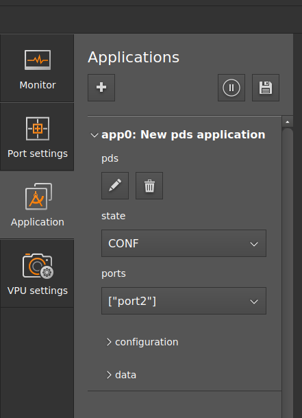

# Getting started with PDS

## Prerequisites

It is expected that a running O3R system (VPU and heads) is connected. Please refer to the [unboxing section](../../GettingStarted/Unboxing/hw_unboxing.md).

A typical procedure for getting started would be as follows
- Connect M04311 to O3R222 camera head and power supply,
- Power up the system,
- Connect to the ifmVisionAssistant (iVA),
- Verify that live images are being received.

## Calibrate the camera

The standard O3R coordinate system is right-handed, with:
- X-axis pointing in the opposite direction to the FAKRA connector,
- Y-axis pointing up,
- Z-axis pointing away from the camera (depth).

For PDS, this coordinate system is rotated to match the typical robot coordinate system orientation, and fixed to the fork tines so that the reference point moves with the forks:
- X-axis pointing in the forward direction of the robot,
- Y-axis pointing to the left, and
- Z-axis pointing up.
- The origin of the coordinate system is fixed to the forks.


The calibrate the cameras, the easiest way is to use the ifmVisionAssistant manual calibration wizard (available for iVA >= 2.7.6):

   ```{image} resources/step_1_iva_man_calibration.png
   :alt: Step 1
   :width: 800px
   :align: center
   ```
1. Select the port to calibrate
   ```{image} resources/iva_calibration.png
   :alt: Step manual calib wizard
   :width: 400px
   :align: center
   ```
1. Click `Rotate like a vehicle front camera`. This orients the coordinate system to match the typical robot coordinate system. 
3. If the camera is mounted horizontally, with the label facing up, you can skip this step. Otherwise, select the orientation of the camera when looking at the front of the camera. If the camera is tilted, enter the additional rotation parameters.
4. Enter the translation parameters from the fork tines coordinate system to the camera.

:::{note}
For more details on the calibration process, you can refer to [the calibration documentation](../Calibration/pds_calibration.md).
For a quick test setup, it is acceptable to have an approximate calibration, as long as the orientation of the camera is correct and the translations are correct to a centimeter or so. 
For a production setup and for testing the performance algorithm, we recommend to precisely calibrate the camera with one of [ifm's provided calibration methods](../../CalibrationRoutines/index_calibrations.md). 
:::

## PDS with ifmVisionAssistant

Before reading this section, make sure you are familiar with the documentation page: [how to get started with the iVA](../../GettingStarted/ifmVisionAssistant/index_iVA.md).

1. Extrinsic calibration is a necessary step before creating a PDS application. Follow the instructions above to calibrate the cameras manually.
2. To create a PDS application instance, click on the `Application' window and click on **+** to create a new application.
3. Select the port in the `Ports` section which is used by PDS application. Only one port can be selected.
4. Change the state of the application from `CONF` to `IDLE`. In `IDLE` mode, the camera can be triggered upon request to collect a frame at a specific time, unlike in `RUN` mode where the camera is continuously streaming data.
   
   

5. In PDS, only one command can be executed at a time. Customize the PDS parameters for the command to be executed.
6. Trigger the command in `Customization/Command` section. The default command has `nop` value ("no operation"). After processing the given command, it returns to its default command value. 
7. View results in the display.


:::{note}
   Click on the `Results` tab under the display window to view the resulting JSON array.
:::
