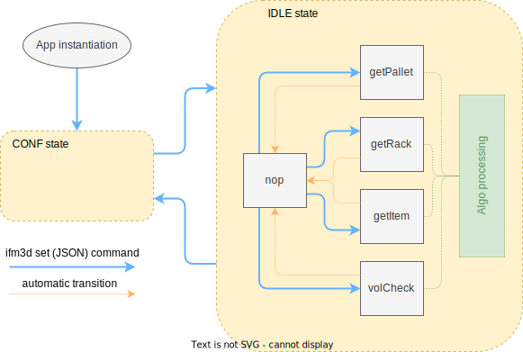

# Software integration guide

PDS' commands are expected to be triggered from the vehicle's main IPC, through the ifm3d library. This document explains the infrastructure expected to configure and trigger PDS.

## States

A PDS application can be in two states:
- "CONF" state is used when first initializing the application and configuring it (defining which camera port should be used, etc.),
- "IDLE" state represents the application ready to receive a command. The application does not produce data when in "IDLE" state until a command is sent.

## Commands

When in "IDLE" state, the PDS application can be triggered using either of the four available commands ([`getPallet`](../GetPallet/getPallet.md), [`getRack`](../GetRack/getRack.md), [`getItem`](../GetItem/getItem.md) or [`volCheck`](../VolCheck/volCheck.md)), along with the command-specific parameters. Once data is processed, the result is published in a frame and can be retrieved using the ifm3d `FrameGrabber` (see examples [here](TODO-ADDLINK)). 

The `nop` command (no operation) is the default command used when the application is in "IDLE" and no specific command was triggered or the triggered command has already completed.

## State machine

The diagram below shows the state machine of PDS' operation.

