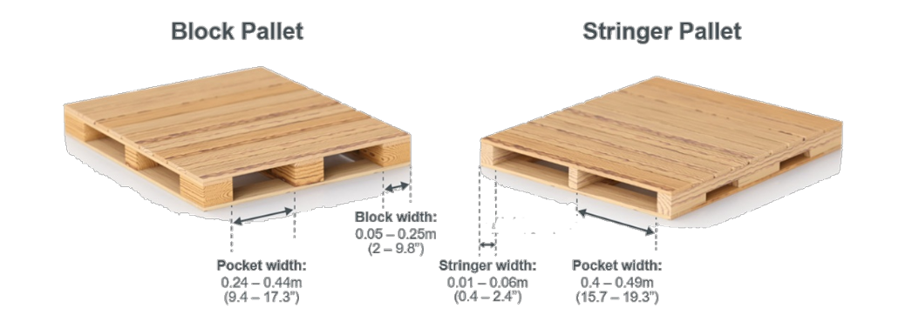

# getPallet

The `getPallet` functionality of PDS is designed to detect the position and orientation of pallets in front of autonomous and semi-autonomous pallet handling vehicles. Usually, such a system has a priori knowledge from the warehouse management like the approximate distance to the pallet and the pallet type.

`getPallet` supports the pick-operation by detecting the precise location of the pallet. In case of unexpected situations like occluded pockets or missing pallet blocks, the pick is considered to be unsafe and the detection will be aborted.

## Usage guidelines
The typical use cases for `getPallet` are pallets with two pockets, either with broad blocks or thin stringers as vertical support structures.


<!-- **Composed pallets** TODO -->

## Input Parameters

**Depth Hint**
The Depth Hint is the approximate distance (distance in meters along the x-axis) that the camera is expected to be away from the pallet. Zero or a negative value can be passed to use an auto-detection of the distance. Please note that this works best with pallets having full-size load and will most likely fail on empty pallets.

**palletIndex**

Input the pallet index based on the pallet type.

| Pallet Index | Pallet type |
| ------------ | ----------- |
| 0(default)   | `Block`     |
| 1            | `Stringer`  |
| 2            | `EPAL side` |

Other variants of pallets, having three or more pockets for example, might also work with PDS, but will require adjustments of the PDS settings. Please contact the ifm support team, if you need to detect further pallet types.

**palletOrder**
If the multiple pallets were detected in the field of view then you can set the order of pallets based on three properties.
- `scoreDescending`(default): The pallet order will be based upon the score (highest to lowest)
- `zAscending`/`zDescending`: The pallet order will be based upon the height from floor.(`zAscending` - lower to upper, `zDescending` - upper to lower)

## Output

1. **numDetectedPallets** : Returns the number of valid pallets detected by the PDS in camera's FoV. (Data type: `uint32`)
2. **pallet**             : Information about pallet's pose. The structure of pallet is given below.

| Name               | Type            | Description                        |
| ------------------ | --------------- | ---------------------------------- |
| numDetectedPallets | uint32          | Number of valid pallets in the FoV |
| pallet             | PalletDetection | Array of PalletDetection Structure |

**PalletDetection Structure**
| Name   | Type               | Description                                                       |
| ------ | ------------------ | ----------------------------------------------------------------- |
| score  | `float32`          | Detection score of the pallet [0..1]                              |
| center | DetectedPalletItem | Center Position and size information of the pallet's center block |
| left   | DetectedPalletItem | Center Position and size information of the pallet's right pocket |
| right  | DetectedPalletItem | Center Position and size information of the pallet's left pocket  |
| angles | Angles3D           | Rotation angles of the pallet                                     |

**DetectedPalletItem structure**
| Name     | Type       | Description                       |
| -------- | ---------- | --------------------------------- |
| position | Position3D | Cartesian coordinates of the item |
| width    | `float32`  | Width of the item in meters       |
| height   | `float32`  | Height of the item in meters      |

**Position3D structure**
| Name | Type      | Description                      |
| ---- | --------- | -------------------------------- |
| x    | `float32` | Cartesian x coordinate in meters |
| y    | `float32` | Cartesian y coordinate in meters |
| z    | `float32` | Cartesian z coordinate in meters |

**Angles3D structure**

| Name | Type      | Description                       |
| ---- | --------- | --------------------------------- |
| rotX | `float32` | Rotation around x-axis in radians |
| rotY | `float32` | Rotation around y-axis in radians |
| rotZ | `float32` | Rotation around z-axis in radians |


```json
{
    "score": Detection score of the pallet [0 ... 1]
    "center": {                                         # Center Position and size information of the pallet's center block
        "position": {
            "x": Cartesian x coordinate in meters,
            "y": Cartesian y coordinate in meters,
            "z": Cartesian z coordinate in meters
            },
        "width": Width of the item in meters,
        "height": Height of the item in meters
        },
    "left": {                                         # Center position and size information of the pallet's left pocket
        "position": {
            "x": Cartesian x coordinate in meters,
            "y": Cartesian y coordinate in meters,
            "z": Cartesian z coordinate in meters
            },
        "width": Width of the item in meters,
        "height": Height of the item in meters
        },
    "right": {                                       # Center position and size information of the pallet's right pocket
        "position": {
            "x": Cartesian x coordinate in meters,
            "y": Cartesian y coordinate in meters,    
            "z": Cartesian z coordinate in meters
            }, 
        "width": Width of the item in meters,
        "height": Height of the item in meters
        }, 
    "angles": {                                     # Rotation angles of the pallet
        "rotX": rotation around x-axis in radians, 
        "rotY": rotation around y-axis in radians, 
        "rotZ": rotation around z-axis in radians
    }
}
```

To initialize a nd configuring the PDS application to execute `getPallet` command, please see the code example below.

```python
###########################################
###2023-present ifm electronic, gmbh
###SPDX-License-Identifier: Apache-2.0
###########################################
"""
Setup:  * O3R222   3D on port2 
            * orientation: camera horizontally (Fakra cable to the left)
        * getPallet: pallet with load in FoV @ 1.5m distance
"""
import ifm3dpy
from ifm3dpy.device import Error as ifm3dpy_error
import json
from ifm3dpy.framegrabber import FrameGrabber, buffer_id
import numpy as np
import time
import default_values

o3r = ifm3dpy.O3R()
try:
    o3r.reset("/applications/instances")
except Exception as e:
    print("Reset failed: %s" % (e))
    pass

c = dict(transX=0.0, transY=0, transZ=0.0, rotX=-1.57, rotY=1.57, rotZ=0)
print("set(/ports/port2/processing/extrinsicHeadToUser)")
o3r.set({"ports": {"port2": {"processing":{"extrinsicHeadToUser": c}}}})

print("set(/applications/instances/app0/class:pds, ports:port2)")
o3r.set({"applications": {"instances": {"app0": {"class": "pds", "ports": ["port2"]}}}})

print("set(/applications/instances/app0/state:IDLE)")
o3r.set({"applications": {"instances": {"app0": {"state": "IDLE"}}}})

time.sleep(0.5)

print("create framegrabber instance")
fg = FrameGrabber(o3r,51010)

PCIC_FORMAT = {
  "layouter": "flexible",
  "format": {
    "dataencoding": "ascii"
  },
  "elements": [
    {
      "type": "string",
      "value": "star",
      "id": "start_string"
    },
    {
      "type": "blob",
      "id": "O3R_RESULT_JSON"
    },
    {
      "type": "blob",
      "id": "O3R_RESULT_ARRAY2D"
    },
    {
      "type": "string",
      "value": "stop",
      "id": "end_string"
    }
  ]
}
fg.start([1002,1003], pcic_format=PCIC_FORMAT)
print("Init done")

GET_PALLET_PARAMETERS = {
          "depthHint": -1, 
          "palletIndex": 0, # Block Pallet/EPAL pallet
          "palletOrder": "scoreDescending"
        }

o3r.set({"applications": {"instances": {"app0": {"configuration": {"customization":{"command": "getPallet", "getPallet":GET_PALLET_PARAMETERS }}}}}})
[ok, frame] = fg.wait_for_frame().wait_for(6000)

if ok:
    if frame.has_buffer(buffer_id(1003)):
            json_chunk = frame.get_buffer(buffer_id(1002))
            json_array = np.frombuffer(json_chunk[0], dtype=np.uint8)
            json_array = json_array.tobytes()
            parsed_json_array = json.loads(json_array.decode())
            print(parsed_json_array["getPallet"]["pallet"])
```

# volCheck

The `volCheck`(short for Volume Check) functionality of PDS offers an easy to use possibility to test whether a 3D box-volume is free of obstacles. An obstacle is defined by an adjustable pixel-count threshold. This command is useful to check wether the block stack or floor drop for obstacles is occupied or not before placing the load.

## Input
**Bounding box parameters for Volume of Interest(VoI)**

The default bounding box parameters for `volCheck`

```json
{
    "xMax": 2.5, Bounding box dimension of VOI along X-axis - Maximum
    "xMin": 1.0, Bounding box dimension of VOI along X-axis - Minimum
    "yMax": 0.3, Bounding box dimension of VOI along Y-axis - Maximum
    "yMin": -0.3,Bounding box dimension of VOI along Y-axis - Minimum
    "zMax": 0.4, Bounding box dimension of VOI along Z-axis - Maximum
    "zMin": 0.1  Bounding box dimension of VOI along Z-axis - Minimum

}
```
## Output

**numPixels** : Number of valid pixels inside the given volume of interest. (Data type: `uint32`)

```python
###########################################
###2023-present ifm electronic, gmbh
###SPDX-License-Identifier: Apache-2.0
###########################################
"""
Setup:  * O3R222   3D on port2 
            * orientation: camera horizontally (Fakra cable to the left)
"""
import ifm3dpy
from ifm3dpy.device import Error as ifm3dpy_error
import json
from ifm3dpy.framegrabber import FrameGrabber, buffer_id
import numpy as np
import time

o3r = ifm3dpy.O3R()
try:
    o3r.reset("/applications/instances")
except Exception as e:
    print("Reset failed: %s" % (e))
    pass

c = dict(transX=0.0, transY=0, transZ=0.0, rotX=-1.57, rotY=1.57, rotZ=0)
print("set(/ports/port2/processing/extrinsicHeadToUser)")
o3r.set({"ports": {"port2": {"processing":{"extrinsicHeadToUser": c}}}})

print("set(/applications/instances/app0/class:pds, ports:port2)")
o3r.set({"applications": {"instances": {"app0": {"class": "pds", "ports": ["port2"]}}}})

print("set(/applications/instances/app0/state:IDLE)")
o3r.set({"applications": {"instances": {"app0": {"state": "IDLE"}}}})

time.sleep(0.5)

print("create framegrabber instance")
fg = FrameGrabber(o3r,51010)

PCIC_FORMAT = {
  "layouter": "flexible",
  "format": {
    "dataencoding": "ascii"
  },
  "elements": [
    {
      "type": "string",
      "value": "star",
      "id": "start_string"
    },
    {
      "type": "blob",
      "id": "O3R_RESULT_JSON"
    },
    {
      "type": "blob",
      "id": "O3R_RESULT_ARRAY2D"
    },
    {
      "type": "string",
      "value": "stop",
      "id": "end_string"
    }
  ]
}
fg.start([1002,1003], pcic_format=PCIC_FORMAT)
print("Init done")

VOLCHECK_PARAMETERS = {
                        "xMin": 2,
                        "xMax": 3.5,
                        "yMin": -0.5,
                        "yMax": 0.5,
                        "zMin": -.8,
                        "zMax":0.4
                    }

o3r.set({"applications": {"instances": {"app0": {"configuration": {"customization":{"command": "volCheck", "volCheck":VOLCHECK_PARAMETERS }}}}}})
[ok, frame] = fg.wait_for_frame().wait_for(6000)

if ok:
    if frame.has_buffer(buffer_id(1003)):
            json_chunk = frame.get_buffer(buffer_id(1002))
            json_array = np.frombuffer(json_chunk[0], dtype=np.uint8)
            json_array = json_array.tobytes()
            parsed_json_array = json.loads(json_array.decode())
            print(parsed_json_array["volCheck"]["numPixels"])
```

# getItem

The  `getItem` functionality of PDS is developed to detect the pose of a specific item. To achieve this, the PDS requires a depth template of the item it aims to detect. A depth template is essentially a reference model of the object, consisting of 3D point cloud data that represents the item from various angles and orientations. This template serves as a basis for comparison during the pose detection process.

To detect a custom item, please contact your local ifm support or support.robotics@ifm.com for detailed instructions for this use case.

## Input Parameters

**Depth Hint:**
The Depth Hint is an approximate distance (distance in meters along the x-axis) that the camera is expected to be away from the item. The default value is **-1** that can be passed to use an auto-detection of the distance.

**itemIndex:**
The ifm development team had developed and tested this functionality on the following trolley types corresponding to their item index.

| itemIndex | Trolley type |
| --------- | ------------ |
| 0         | `TA LSB`     |
| 1         | `TA SS`      |
| 2         | `Dolly BR`   |

**itemOrder:**
When multiple items are detected then the order of the detected items can be set based on the following properties.

- `scoreDescending`(default): The item order will be based upon the score (highest to lowest)
- `zAscending`/`zDescending`: The item order will be based upon the height from floor.(`zAscending` - lower to upper, `zDescending` - upper to lower)

## Output Parameters

**numDetectedItems:**
Number of items detected in the camera's FoV.

**item:**
Information of item's pose. The output structure of an item is given below.

| Name             | Type          | Description                      |
| ---------------- | ------------- | -------------------------------- |
| numDetecteditems | uint32        | Number of valid items in the FoV |
| item             | itemDetection | Array of itemDetection Structure |

**itemDetection Structure**
| Name     | Type       | Description                        |
| -------- | ---------- | ---------------------------------- |
| score    | `float32`  | Detection score of the item [0..1] |
| position | Position3D | Cartesian coordinates of the item  |
| angles   | Angles3D   | Rotation angles of the item        |

**Position3D structure**
| Name | Type      | Description                      |
| ---- | --------- | -------------------------------- |
| x    | `float32` | Cartesian x coordinate in meters |
| y    | `float32` | Cartesian y coordinate in meters |
| z    | `float32` | Cartesian z coordinate in meters |

**Angles3D structure**

| Name | Type      | Description                       |
| ---- | --------- | --------------------------------- |
| rotX | `float32` | Rotation around x-axis in radians |
| rotY | `float32` | Rotation around y-axis in radians |
| rotZ | `float32` | Rotation around z-axis in radians |

To initialize a nd configuring the PDS application to execute `getItem` command, please see the code example below.


```python
###########################################
###2023-present ifm electronic, gmbh
###SPDX-License-Identifier: Apache-2.0
###########################################
"""
Setup:  * O3R222   3D on port2 
            * orientation: camera horizontally (Fakra cable to the left)
        * getItem: item/s in FoV @ 1.5m distance
"""
import ifm3dpy
from ifm3dpy.device import Error as ifm3dpy_error
import json
from ifm3dpy.framegrabber import FrameGrabber, buffer_id
import numpy as np
import time

o3r = ifm3dpy.O3R()
try:
    o3r.reset("/applications/instances")
except Exception as e:
    print("Reset failed: %s" % (e))
    pass

c = dict(transX=0.0, transY=0, transZ=0.0, rotX=-1.57, rotY=1.57, rotZ=0)
print("set(/ports/port2/processing/extrinsicHeadToUser)")
o3r.set({"ports": {"port2": {"processing":{"extrinsicHeadToUser": c}}}})

print("set(/applications/instances/app0/class:pds, ports:port2)")
o3r.set({"applications": {"instances": {"app0": {"class": "pds", "ports": ["port2"]}}}})

print("set(/applications/instances/app0/state:IDLE)")
o3r.set({"applications": {"instances": {"app0": {"state": "IDLE"}}}})

time.sleep(0.5)

print("create framegrabber instance")
fg = FrameGrabber(o3r,51010)

PCIC_FORMAT = {
  "layouter": "flexible",
  "format": {
    "dataencoding": "ascii"
  },
  "elements": [
    {
      "type": "string",
      "value": "star",
      "id": "start_string"
    },
    {
      "type": "blob",
      "id": "O3R_RESULT_JSON"
    },
    {
      "type": "blob",
      "id": "O3R_RESULT_ARRAY2D"
    },
    {
      "type": "string",
      "value": "stop",
      "id": "end_string"
    }
  ]
}
fg.start([1002,1003], pcic_format=PCIC_FORMAT)
print("Init done")

GET_ITEM_PARAMETERS = {
          "depthHint": -1, 
          "itemIndex": 0, # TA LSB (DHL wagon)
          "palletOrder": "scoreDescending"
        }

o3r.set({"applications": {"instances": {"app0": {"configuration": {"customization":{"command": "getItem", "getItem":GET_ITEM_PARAMETERS }}}}}})

[ok, frame] = fg.wait_for_frame().wait_for(6000)

if ok:
    if frame.has_buffer(buffer_id(1003)):
            json_chunk = frame.get_buffer(buffer_id(1002))
            json_array = np.frombuffer(json_chunk[0], dtype=np.uint8)
            json_array = json_array.tobytes()
            parsed_json_array = json.loads(json_array.decode())
            print(parsed_json_array["getItem"]["item"])
```
