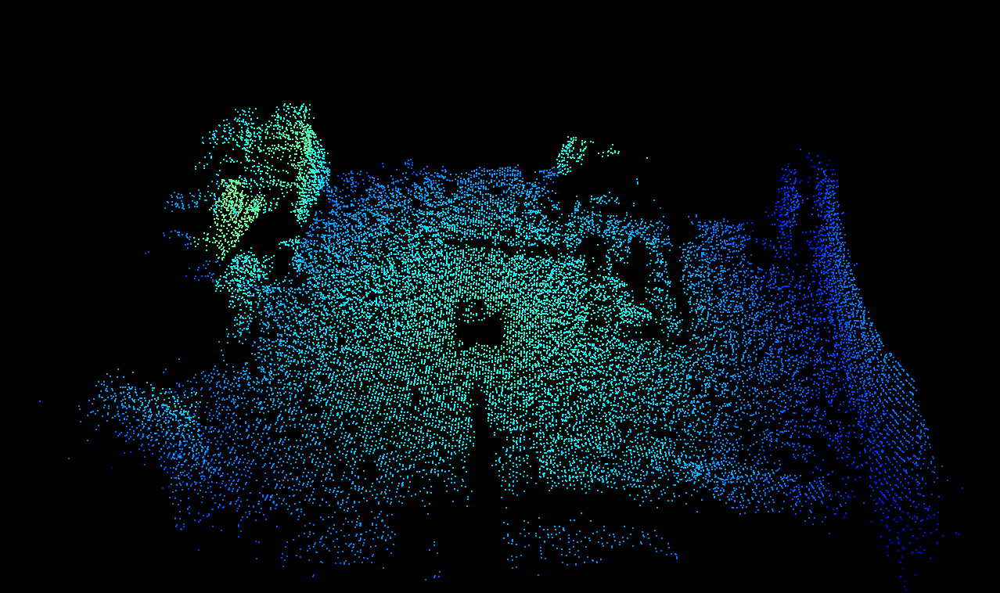
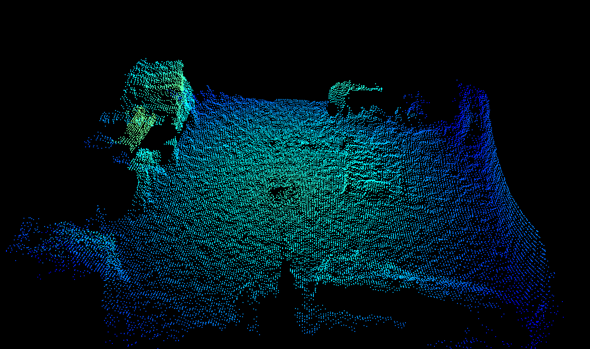
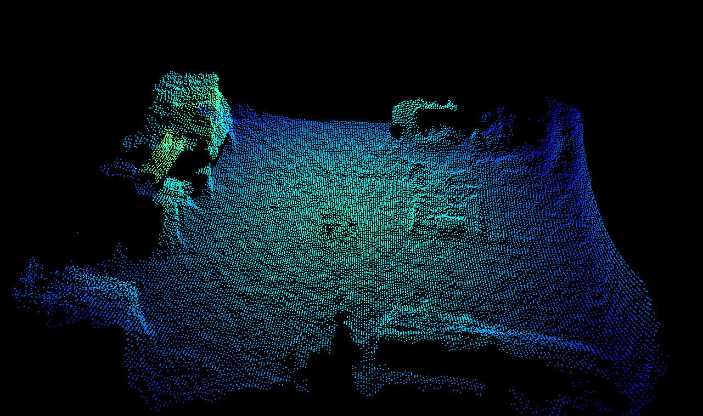
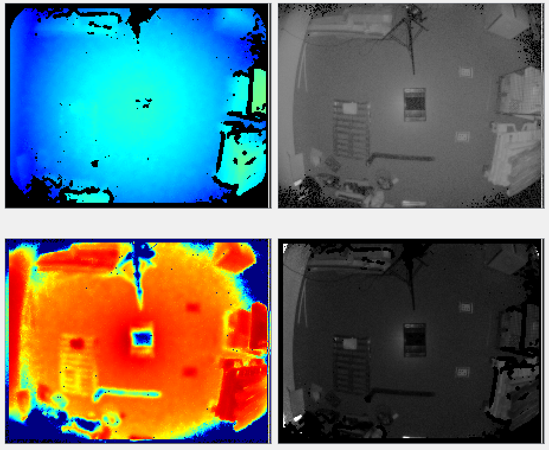

# Adaptive noise bilateral filter
## Abstract
The O3R software allows for filtering the distance measurement in the spatial domain. The spatial domain of a 3D image can be thought of as the local neighborhood of a pixel, i.e., the neighboring pixels X-, Y-, and Z-coordinates. Radial distance information for a pixel is combined with it's neighbors' to form a new distance image with reduced noise.  

The bilateral filter is the preferred spatial filter and is enabled by default. It can be applied with different filter mask sizes which can be set via the parameter `anfFilterSizeDiv2`. Larger filter mask sizes allow for stronger noise reduction.

## Description

This distance bilateral filter is in it's concept very similar to a [bilateral filter applied to RGB 2D images](https://en.wikipedia.org/wiki/Bilateral_filter). A bilateral filter is a non-linear edge-preserving smoothing filter. The idea is is to replace the pixel value with a weighted average of the information from nearby pixels. The weighting is a combination of the spatial kernel and the range kernel. The O3R implementation additionally incorporates the distance noise estimation for calculating the filter weights.     

> Note: The weighted average is computed by convolution over the spatial domain. The convolution of the original image and the filter mask returns an image reduced by half the filter size at each image border, i. e., with a filter mask of 7x7 pixels, the image is striped of 7 pixels vertically and horizontally (these pixels are marked as invalid).

The bilateral filter is controlled by the parameter `anfFilterSizeDiv2` (turn it off with `anfFilterSizeDiv2 = 0`). `anfFilterSizeDiv2 = 3` sets the filter mask size to a local 7x7 pixel neighborhood.   

> Note: The bilateral filter is preferred over the [median filter](medianFilter.md) as it preserves edge and corner information better (the median filter tends to *round* corners). It is also possible to apply the bilateral filter with larger filter masks (up to 7x7 pixel mask) compared to (5x5 pixel masks) for the median filter. The size of the mask defines how many neighboring pixels are taken into account when computing a pixel's value.   

Invalid pixels will be ignored during the filtering process and have therefore no impact on the surrounding pixels. Invalid pixels will remain invalid after the filtering. 

TODO: decide which parameters will be made public: `anfSigmaLat` and `anfFactorRangeNoise`. These parameters allow for further fine-tuning of the bilateral filter.  
### Example

The following pictures give an overview of the capabilities of spatial filtering with the bilateral filter for different filter mask sizes. All other filters ([temporal](INSERT-LINK) and [median](medianFilter.md)) are deactivated for the purpose of illustrating the bilateral filter's effect. The maximum allowed distance noise is set of 0.2 m for all images. Note that for maximum distance noise values below 0.2m the point cloud becomes very sparse for smaller filter mask sizes (not shown below).  

The scene shows a view of our lab, containing various typical objects including a black tote in the center of the room. It is a static scene, which makes it simpler to illustrate the filter's effect, but these settings (active bilateral filter and inactive temporal filter) are typical for scenes involving motion. Have a look more specifically at the distance noise images in the table below. We can see that the distance noise greatly reduces as the filter mask size increases (the color red denotes negligible noise when blue represents noise of around 1cm and above).

| Bilateral filter mask size| Point cloud| Distance (top left), amplitude (top right), distance noise (bottom left) and reflectivity images (bottom right)| |
|--|--|--|--|
| 0 (filter disabled)| | | | 
| 1 (3x3 mask size)| | | |
| 2 (5x5 mask size)| | | |
| 3 (7x7 mask size)| | | |

> Note: distance information for the black tote in the middle of the image remains very hard to compute even with a *strong* lateral filtering. For better handling dark objects, have a look at the [minimum amplitude](minAmplitude.md), [maximum distance noise](maxDistNoise.md) and [temporal filter](INSERT-LINK).

### Scenes involving motion
The spatial filtering can be performed in scenes where motion is present: only the parts of the images which are not affected by movement will be filtered. This differentiation is possible because the detection of motion is performed before the spatial filter in the processing pipeline. It is perfectly fine and encouraged to use large filter mask sizes.

> Note: this is not true for [temporal filtering](INSERT-LINK), which is not best suited for in-motion cases.

## Related topics
+ [Median filter](medianFilter.md)
+ [Temporal filter](INSERT-LINK)
+ [Minimum amplitude](minAmplitude.md)
+ [Minimum reflectivity](INSERT-LINK)
