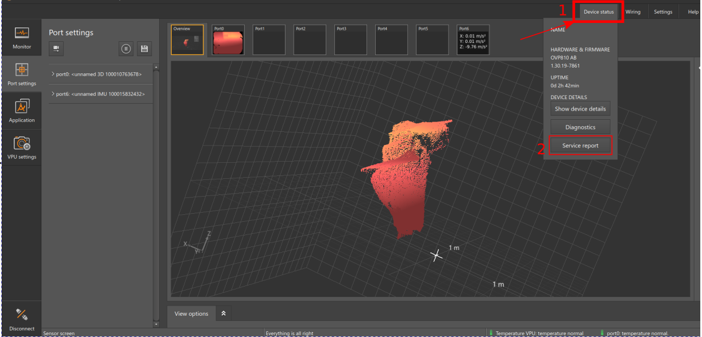
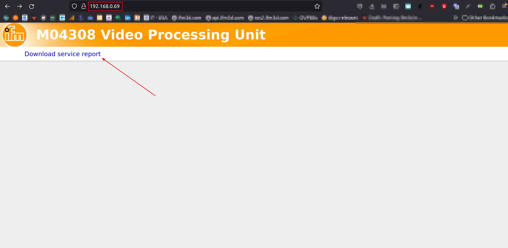

# Service report

The service report contains all the logs necessary for troubleshooting issues with the O3R platform: the JSON configuration of the device and JSON schema, the diagnostic messages and some additional internal logs.

Make sure to share the downloaded service report archive to the ifm support team when working together to resolve an issue.

## Download from ifmVisionAssistant

> Note: Please always use the latest ifmVisionAssistant available at [product download page](https://www.ifm.com/de/en/product/OVP810#documents)

To download the service report from ifmVisionAssistant tool

1. Navigate to 'Device Status' on top rightside of the main window
2. Click on 'Service Report' to download the service report and select the path to download the ZIP file.



## Download from a browser

To download the service report, connect to the current IP address of the device in a browser and click on the download link



## Download using ifm3d CLI

```bash
ifm3d ovp8xx --ip=<IP_ADDRESS_OF_VPU> getServiceReport
```

## Download using curl
You can also download the service report from a terminal using curl:
```bash
$ curl -JO http://192.168.0.69/service_report/
  % Total    % Received % Xferd  Average Speed   Time    Time     Time  Current
                                 Dload  Upload   Total   Spent    Left  Speed
100  179k    0  179k    0     0   402k      0 --:--:-- --:--:-- --:--:--  403k

```