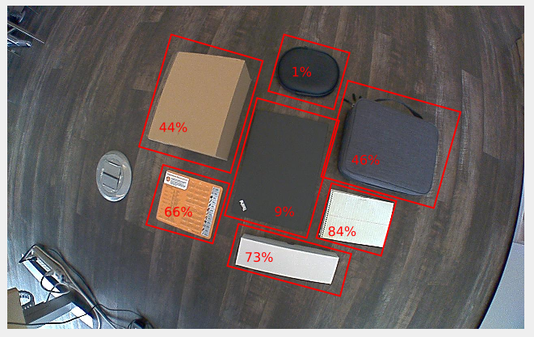
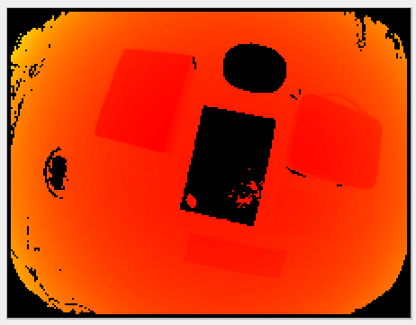

# Minimum Reflectivity

## Description

Reflectivity in the near-infrared (NIR) spectrum is a property of the material from which an object reflects light. This characteristic is influenced by both the surface material of the object and the geometric arrangement of the scene.

The minimum reflectivity (`minReflectivity`) filter serves to invalidates pixels that have received low amounts of light (that is, pixels on objects with a reflectivity below the minimum threshold). The `minReflectivity` filter value represents the percentage threshold for invalidating the pixel, with a range from 0 (minimum) to 100 (maximum).

The computation of reflectivity involves analyzing the distance and amplitude images. Additionally, this parameter can be employed to identify highly reflective objects within a scene, with the maximum reflectivity value capped at 100%. Setting a higher threshold (eg. 85) would likely invalidate nearly everything except for retro-reflectors.

## Example
In the image below, we show objects with their measured reflectivity. In this case the reflectivity depends on the material of the object only because their surfaces are seen under the same angle relative to the surface’s normal. The estimated reflectivity might vary for the same object seen under varying angles to surfaces normals. Note that this pertains to reflectivity in the NIR spectrum. Some objects might show a higher or lower reflectivity than expected in the visible spectrum.

The corresponding reflectivity image is nothing more than a gray-scale image. Darker shades represent lower reflectivity values:

In the table below, we show the computed distance image for the default settings of the O3R heads with different values for the reflectivity threshold `minReflectivity`:

| Reflectivity| Distance image|
| --| --|
| 0| |
| 5| |
| 10| |

> Note: In the first image, some pixels are missing from the side of the object. This area of the object does not reflect enough light, even when a low reflectivity threshold is allowed.

## Related topics
- [Minimum amplitude](./minAmplitude.md)
- [Available images](../ImagesDescription/index_images_description.md)